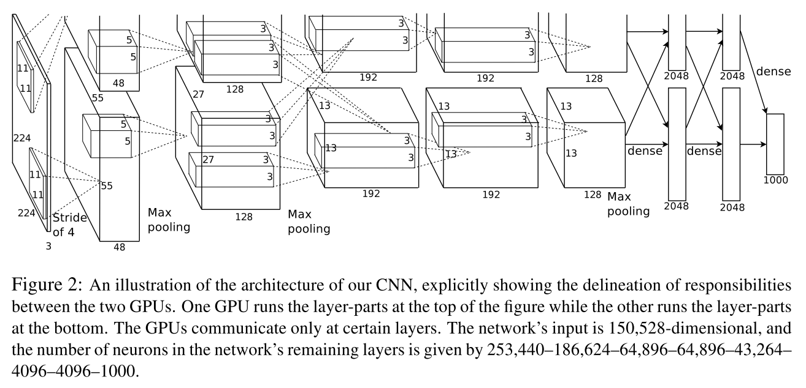

# [ImageNet Classification with Deep Convolutional Neural Networks](https://papers.nips.cc/paper/4824-imagenet-classification-with-deep-convolutional-neural-networks.pdf)

Date: 12/3/2012  
Tags: task.object_classification

- The authors are motivated to train a large convolutional neural network to perform image classification on a large scale
- They propose an eight layer convolutional neural network to perform image classification
    - They use five convolutional and three fully connected layers, with the network spread across two GPUs. The loss they use is a multinomial logistic regression applied to the result of a 1000 way softmax.
    - They find that the following tricks improve performance:
        - Using ReLU nonlinearities to speed up training (these train ~6 times faster than using tanh nonlinearities)
        - Splitting the network between two GPUs, and having those GPUs only communicate on certain layers
        - Using local response normalization to the activity of the neurons in between layers
        - Using overlapping pooling, which they found to help prevent overfitting to a very small extent
        - Using data augmentation to prevent overfitting (they use translations plus reflections, and altering the instensities of the RGB channels using the results of PCA on the training set)
        - Using dropout to prevent overfitting
- They test their method on the ILSVRC-2010 and ILSVRC-2012 datasets, and set SOTA by a large margin

## ImageNet Architecture

