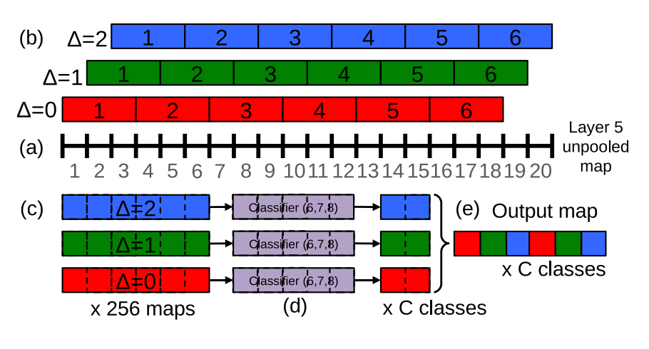

# [OverFeat: Integrated Recognition, Localization and Detection using Convolutional Networks](https://arxiv.org/abs/1312.6229)

Date: 12/21/2013
Tags: task.object_classification, task.object_localization, task.object_detection

- The authors are motivated to develop an integrated method for simultaneous classification, location, and detection of objects in images, as well as suggest a novelty in localization and detection where predicted bounding boxes are accumulated, rather than suppressed
    - By combining predicted bounding boxes, detection can be performed without training on background samples (they say this, but still train on negative (i.e. background) examples)
- Their approach consists of a couple of key ideas:
    - Apply the ConvNet (e.g. for classification) at multiple locations in the image (in a sliding window fashion), and over multiple scales
        - Multi-scale classification is realized by passing in inputs of multiple scales of input, and performing the last subsampling (max pooling) operation at offsets of the input feature map (in a sliding window fashion)
        - They then take the spatial max for each class (at each scale / flip) and average the resulting class probabilities
    - Predict the location and size of the bounding box containing the object relative to the sliding window (in addition to the classification)
    - Aggregate the bounding boxes from the sliding windows rather than suppressing boxes
- Their networks all share the same feature extraction layers.
    - The classification network adds three fully connected layers followed by a softmax to generate its class score predictions.
    - The regressor adds two fully connected layers followed by an output layer of 4 units specifying the (top, left, bottom, right box edges)
        - The regressor is trained on bounding boxes that have at least 50% overlap with the input field of view
        - They combine the multiple bounding box predictions via a greedy merge strategy: 
            1. Merge two boxes using the average of their coordinates after computing a match score based off the distance between the centers of the two bounding boxes and intersection area of the boxes.
            2. The boxes with minimum match score are iteratively merged until the minimum match score is above some threshold (this seems off, not sure if I interpreted it right).
    - The localization network is the classifier / regressor but without negative examples.
    - The detection network is simply the classifier and localization network (regressor), but trained with negative examples that are mined on the fly (choosing some # per image that are random ones or the most offending negative ones)
- They test their approach on ILSVRC
    - For classification, they ranked 5th
    - For localization and detection, they set new SOTA

## Subsampling at offsets

