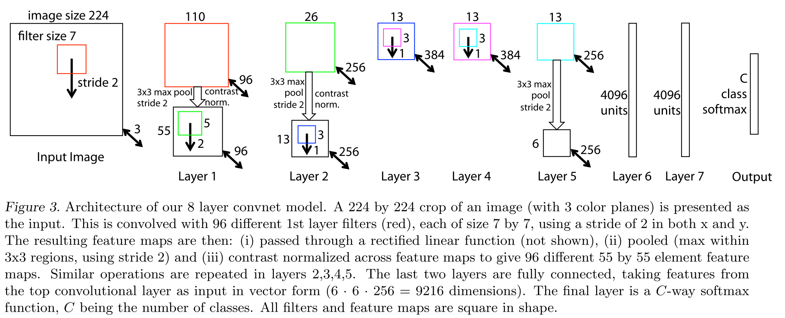
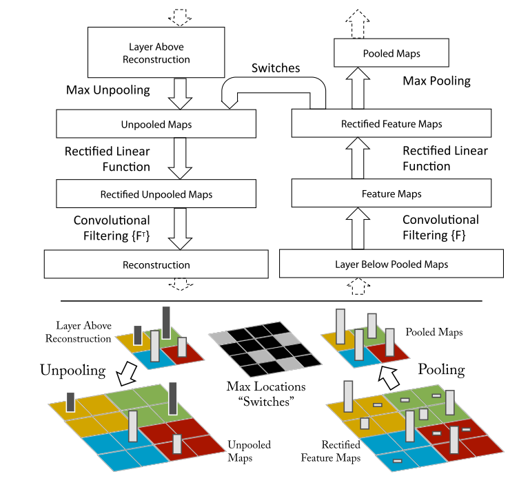
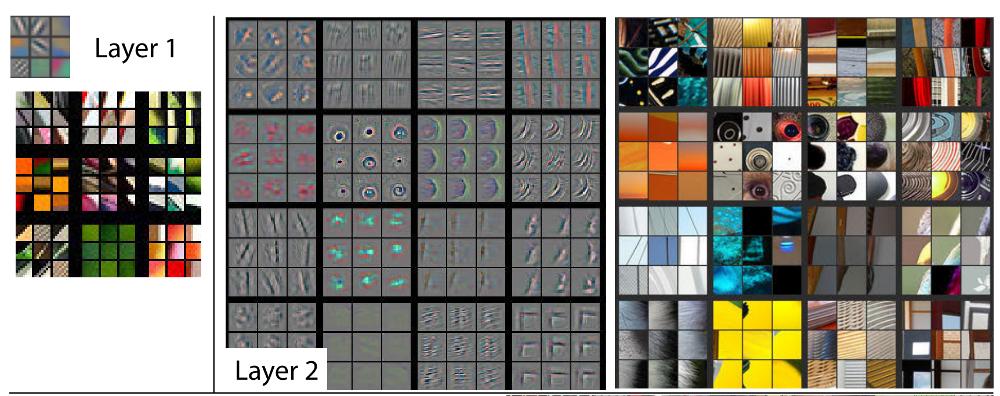

# [Visualizing and Understanding Convolutional Networks](https://arxiv.org/abs/1311.2901)

Date: 11/12/2013  
Tags: task.object_classification, topic.understanding_neural_networks

- The authors are motivated to visualize and gain insight into the function of the intermediate and classification layers of a convolutional neural network
- The authors propose the use of a deconvolutional network to map feature activities back to the pixel space in order to visualize the learned features
    - The deconvolutional net is simply a convolutional network in reverse
    - To examine a convoulutional network, the authors:
        1. Attach a deconvolutional network to each of the convolutional networks layers.
        2. Pass an input image through the convolutional network to have features computed throughout the layers.
        3. Examine a given activation by setting all other activations in the layer to zero and passing the feature maps as inputs to the attached deconvolutional layer.
- The authors test their method by training a network (AlexNet) on ImageNet, and using their visualization technique to alter the network for better performance.
    - They outperform AlexNet by 1.7% for the top-5 test error when using a single model, and 0.5% when using multiple models.
    - They set SOTA on Imagenet with a 14.8% top-5 test error.
- Through training / experimentation, they note:
    - The lower layers of the model converge within a few epochs, while the upper layers develop only after a considerable number of epochs (40-50).
    - Small image transformations (e.g. translation, scaling, and rotation) have a dramatic effect in the first layer of the model, but a lesser impact at the top feature layer
    - Visualizing the first and second layers of AlexNet, there are a number of dead neurons in the first layer and aliasing artifacts in the second layer. They remedy these problems by reducing the 1st layer filter size from 11x11 to 7x7 and changing the convolution stride to 2 rather than 4.
    - When the object of interest is occluded from the image, the probability of the correct class drops significantly. In addition, the feature map that shows the strongest activity on the unoccluded image shows a significant drop in activity when the object of interest is occluded. This suggests that the network is truly learning to identify the location of the object in the image.
    - Removing the fully connected layers from their network only gives a slight increase in error, as does removing two of the middle convolutional layers.
    - Removing both the fully connected and two middle convolutional layers yields a model with drastically worse performance.

## Network Architecture

## Deconvolutional Layer

## Feature Map Visualization

