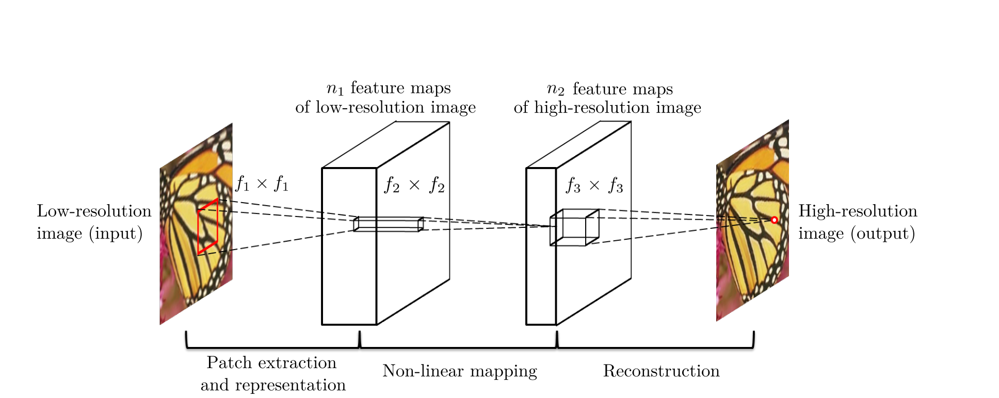

# [Image Super-Resolution Using Deep Convolutional Networks](https://arxiv.org/abs/1501.00092)

Tags: task.image_super_resolution  
Date: 12/31/2014

- The authors are motivated to develop a fully convolutional network for image super-resolution
    - A fully convolutional network conceptually consists of the three operations that are present in a standard sparse-coding-based example-based super-resolution method: patch extraction and representation, non-linear mapping, and reconstruction. 
        - When using a convolutional network, *all* of these operations are optimized, and they are all optimized together since the network is trained end-to-end.
- The authors propose a fully convolutional network for image super-resolution
    - The network takes in a low-resolution image and outputs a high-resolution image, and consists of three convolutional layers: 
        - The first extracts a set of feature maps from the low-resolution image
        - The second layer maps these feature maps nonlinearly to high-resolution patch representations
        - The third layer combines the predictions within a spatial neighbourhood to produce the final high-resolution image
    - They train the network by minimizing the mean-squared error between the predicted high-resolution image and the ground truth high-resolution image, and evaluate using the peak signal-to-noise ratio (PSNR), structure similarity index (SSIM), multi-scale SSIM, information fidelity criteria (IFC), noise quality measure (NQM), and weighted PSNR 
- They test the proposed method on two smaller datasets, in addition to the images from the detection training partition of ImageNet
    - Super-resolution is applied and evaluated only on the luminance channel (Y channel in YCbCr color space)
    - Compared to a number of different baselines, their method yields the highest scores on most evaluation metrics in all experiments
- Through training / experimentation, they note:
    - With a modest number of filters and layers, their method achieves fast speed for practical on-line usage even on a CPU
    - The performance of the proposed method may be further boosted by using a larger training set (e.g. training on imagenet instead of either of the two smaller datasets)
    - Network performance improves if they increase the width of the network (i.e. add more filters)
    - Larger filter sizes could improve performance (e.g. using filters of size 5 or 9 in some of the layers instead of all filters being size 3)
    - A four layer network converges more slowly, and doesn't outperform the three layer network
    - When testing their method using color channels, they find that training with the RGB channels performs similarly to training on only the luminance channel. They also find that training on other combinations of the channels in the YCbCr space does not yield better results than training on only the luminance channel (Y).

## Network Architecture

