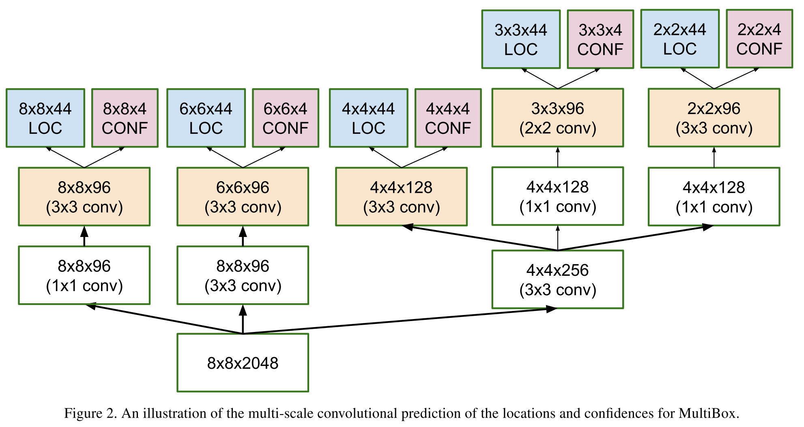

# [Scalable, High-Quality Object Detection](https://arxiv.org/abs/1412.1441)

Date: 12/3/2014  
Tags: task.object_detection

- The authors are motivated to build a deep learning-based object proposal method to improve object detection performance
- They propose a method that divides the input image into a grid of cells, and then predicts coordinates and confidences of objects contained in the cells
    - The architecture they propose is a multi-scale convolutional network that minimizes a loss that is the weighted sum of a confidence loss (that a proposal corresponds to an object of interest) and a location loss (L2 loss between the predicted and actual bounding box coordinates)
        - In a simple version of the architecture, it just takes in the object features and produces the predicted output. In a combiner version, they also concat whole image features to the object features to produce the predicted output.
        - They also experiment with training a "post-classifier" on top of this architecture - it takes the object proposals that are high confidence and predicts the class of the objects within the proposal.
        - In large part, they useed Inception style networks
    - To train, they use priors that lie on a regular grid of the image, and have at least 0.5 IoU with a ground truth bounding box; they then regress the priors towards the ground truth
    - They use "hard bootstrapping" to alleviate the case where the network produces a high confidence prediction for a true positive object whose label is missing
- Through experimentation, they learned:
    - Switching from a Zeiler-Fergus style network to an Inception-style network greatly improved quality of the proposals (as gauged by the average precision and max recall of the top-K proposals)
    - Increasing the number of priors from 150 to 800 (where it started to level off) greatly improved performance (again gauged by average precision and max recall of the top-K proposals)
    - Taking multiple crops of the image at multiple scales / locations and combining all of the generated proposals and applying non-maximal suppression greatly improves mean average precision (~10% relative improvement)
    - A deep learning based proposal method can perform just as well as the state-of-the-art engineered proposal generation methods

## MultiBox Architecture 

