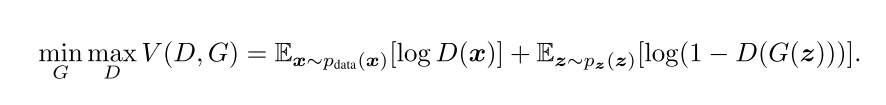
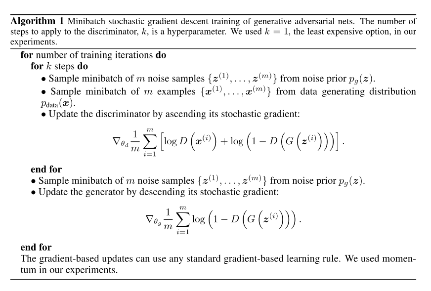
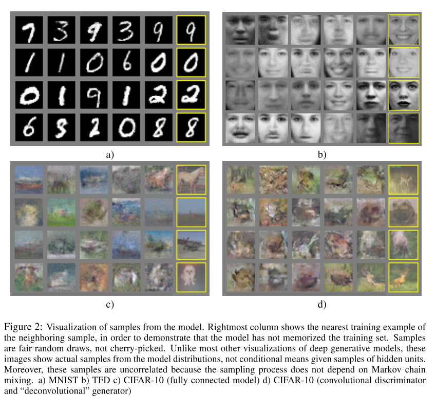

# [Generative Adversarial Networks](https://arxiv.org/abs/1406.2661)

Date: 06/10/2014  
Tags: task.image_generation, topic.generative_adversarial_networks

- The authors are motivated to develop an adversarial framework for estimating generative models
- The authors propose an adversarial nets framework, in which a generative model is pitted against an adversary - a discriminative model that learns to determine whether a sample is from the generative model or the underlying data distribution
    - The two models involved in the framework are both multilayer perceptrons:
        1. *Generator* (G) - the goal of the generator is to map a given input of noise (drawn from some distribution p(z)) to a data space, i.e. p(data). The output of the generator is the same dimensionality as an element from the data space.
        2. *Discriminator* (D) - the goal of the discriminator is to assign the correct distribution label to the provided input, i.e. whether it came from the generator or the real data distribution. The output of the discriminator is a single scalar number.
    - The discriminator (D) and generator (G) play a two-player minimax game with the value function V(G, D):

    
- The authors test their proposed method on MNIST, the Toronto Face Database, and CIFAR-10, and generate images that they believe to be competitive with existing methods (i.e. deep belief networks, contractive auto-encoders, and deep generative stochastic networks)

## Generative Adversarial Net Training Algorithm

## Generator Output Examples

