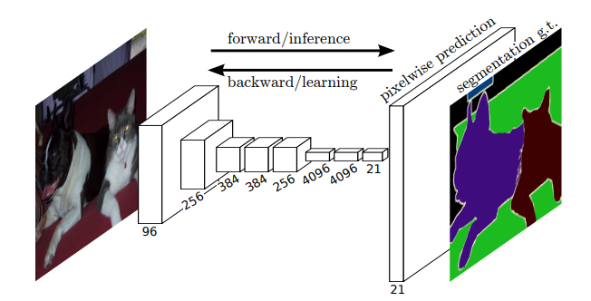

# [Fully Convolutional Networks for Semantic Segmentation](https://arxiv.org/abs/1411.4038)

Date: 11/14/2014  
Tags: task.semantic_segmentation

- The authors provide a novel way of performing more efficient and accurate semantic segmentation by using fully convolutional networks, as opposed to more traditional patch based approaches
    - Older patch based approaches would predict the center pixel of each patch, and then obtain a dense output by stitching the results back together
- The authors adapt standard classification networks  (AlexNet, VGG, and GoogLeNet) by:
    1. Lopping off the final classification layer
    2. Converting all fully connected layers into convolutions
    3. Adding a 1x1 convolutional layer with $n$ filters, where $n$ is the number of output classes
    4. Adding a de-convolution layer to bi-linearly upsample the coarse predictions to dense pixel-wise output predictions.
- They test on PASCAL VOC, NYUDv2, and SIFT Flow, and achieve SOTA on each
    - SIFT Flow contains two tasks (semantic categories and geometric categories), and they find that their FCN with two heads performs as well on both tasks as two independently trained models
    - They find that inference is 5 - 25x faster (5x assumes efficient batching of input images, 25x was for a single image)
    - They train using a per-pixel multinomial logistic loss
- In studying different components, they find:
    - Instead of using simple bi-linear interpolation for upsampling, they can use de-convolutions (convolutions with stride 1 / $f$ ) and learn the parameters for upsampling
        - They claim that using learned upsampling in this way produces more accurate results (although don't show any experiments)
   - Combining the layers of the feature hierarchy to produce the final output can significantly improve performance (by ~5%)
       - Their original FCN-32 simply upsampled the final output layer
       - In other networks (FCN-16 and FCN-8), they upsampled the results of previous pooling layers, using a 1x1 convolutional layer on the upsampled features (to produce a secondary output layer), and sum that with the other output layers to get the final predictions
            - They found that performance gains started to stagnate at FCN-8, and thus did not continue on to trying another network
  - They found class balancing to be unncessary
  - To try to match the extra variation (that might lead to faster convergence) that is achieved when randomly sampling patches, they perform some runs using spatial sampling on the loss (i.e. by randomly sampling the the final layer cell at some points), but find that this does not have a significant effect on convergence rate

## FCN Architecture

## FCN Results

