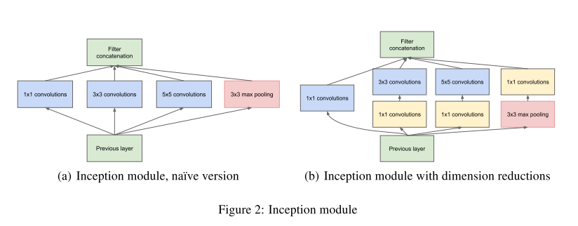

# [Going Deeper with Convolutions](https://arxiv.org/abs/1409.4842)

Date: 09/17/2014  
Tags: task.object_classification, task.object_detection, topic.deep_supervision

- The authors are motivated to improve utilization of computing resources within convolutional neural networks
    - The most straightforward way of improving the performance of a neural network is by increasing its size, but this comes at the cost of a larger likelihood of overfitting as well as an increase in computational budget. The authors are motivated to improve the performance, but to do so in a way that avoids these limitations.
    - They propose moving from fully connected to sparsely connected architectures, even within the convolutions
- The authors propose a local sparse structure inside a convolutional neural network, where "Inception modules" with 1x1 convolutions are used to try to create a sparse structure
    - Their Inception network consists of Inception modules stacked upon each other, with occasional max-pooling layers with stride 2. For memory efficiency during training, they started using Inception modules only at higher layers, while keeping the lower layers in traditional convolutional fashion.
    - They add two auxiliary classifiers to the output of the middle of the network in the hopes of improving gradient propagation through the network as well as encouraging discrimination in the lower stages of the classifier
    - For classification with this network, they simply use Softmax operations on the output layers
    - For detection with this network, they take a similar approach to R-CNN, but use the Inception model as the region classifier
- The authors test their method on the 2014 ILSVRC (ImageNet) classification and detection challenges
    - They set SOTA on the classification task
    - They set SOTA on the detection task as well
        - Their single model is not the top performer on this task, but their ensemble is the top
- Through training / experimentation, they note:
    - Using both Selective Search and multi-box predictions improves object recall for the object detection model
    - Aggressive test time multi-crop predictions improve performance on the classification task, but the benefit of more crops becomes marginal after a reasonable number of crops are present

## Inception Modules

