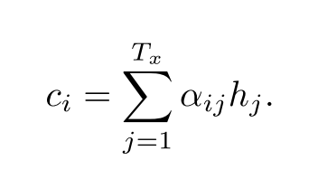
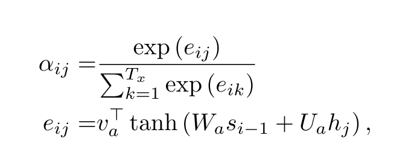

# [Neural Machine Translation by Jointly Learning to Align and Translate](https://arxiv.org/abs/1409.0473)

Date: 11/01/2014  
Tags: task.neural_machine_translation, topic.soft_attention  

- The authors are motivated to develop a method that allows for a basic encoder-decoder, sequence to sequence architecture to search for parts of the source sequence that are important for predicting the target sequence
    - They believe that the use of a fixed-length vector in traditional sequence to sequence models is a bottleneck in performance, and in particular when working with longer sequences. The fixed-length vector forces the encoder to compress all necessary information of a source sequence into a fixed-length.
- The authors propose an extension to the encoder-decoder model that learns to align and jointly translate
    - In their approach, the input sequence is encoded into a sequence of vectors, and the decoder chooses a subset of these vectors adaptively as the "context" while decoding the translation
- The authors test their method on English-to-French translation using the ACL WMT ’14 dataset
    - When testing on sequences of both 30 and 50 words, they find that the added attention mechanism outperforms the more traditional encoder-decoder model without an attention mechanism
- Through training / experimentation, they note:
    - The models with an attention mechanism are more robust to the length of the sentences, and show much less (if any) performance deterioration as the sentence length increases
    - Visualizing the weights associated with the annotations (i.e. visualizing what source words were attended to) shows that the model learned to correctly swap the order of adjectives and nouns when the source and target sequences had them swapped (as is common between English and French)

## Attention Mechanism

