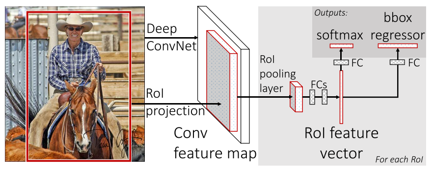

# [Fast R-CNN](https://arxiv.org/abs/1504.08083)

Date: 04/30/2015
Tags: task.object_detection

- The authors are motivated to address some of the limitations of R-CNN and SPPnet while at the same time improving detection performance
    - Notable disadvantages of R-CNN include:
        1. Training is multi-stage, and includes the fine-tuning of the classification CNN, fitting of SVMs, and training bounding-box regressors.
        2. Training in expensive in space and time (for SVM training features are written to disk).
        3. Object detection is slow.
   - Notable disadvantages of SPPnet include all the disadvantages of R-CNN plus not being able to efficiently fine-tune the convolutional layers that precede the spatial pyramid pooling layers.
- The Fast R-CNN architecture takes as input an entire input image and a set of object proposals, and consists of several components:
    - The network first processes the whole image into a set of feature maps using convolutional and max pooling layers. 
    - For each object proposal, an ROI pooling layer extracts a fixed-length feature vector from the feature maps. 
        - The size of this fixed length feature is a hyper-parameter.
        - They use the implementation proposed in SPPnet
    - Each feature vector is fed into some number of fully connected layers that ultimately branch into two output layers predicting (a) softmax probabilities for the object classes, and (b) 4 values that encode refined bounding-box positions
- Training includes a couple of tricks / details:
    - To speed up training, they sample mini-batches hierarchically; they first sample N images and then sample R / N ROIs from each image. Although this results in more correlated inputs in any given batch, they find that this does not slow down convergence in practice.
    - The bounding-box regressor loss is only applied for ground truth class for any given input (i.e. errors are ignored for all classes that are not the ground truth).
    - The bounding-box regressor loss is not applied for the background class.
    - When constructing mini-batches, they take 25% of the ROIs from object proposals having >= 0.5  IoU overlap with a ground truth bounding box, and the rest of those with overlap from [0.1, 0.5).
- They test their method on VOC 2007, 2010, and 2012
    - On VOC 2010, they achieve the top result and are two orders of magnitude faster than other methods
    - On VOC 2012, they place second
    - ON VOC 2007, they just look to compare Fast R-CNN to SPPnet, and find that it performs better than both. 
- In evaluating the design / performing ablation type studies:
    - They find that the multi-task training improves the mAP performance both over non multi-task training as well as stage-wise training
    - Single-scale detection performs almost as well as multi-scale detection, suggesting that ConvNets are adept at directly learning scale invariance
    - When tripling the size of the training set, the network performance improves by about ~5%; this is in comparison to other methods that see a level off in performance after only a few hundred to thousand training examples
    - Softmax slightly outperforms SVM with their setup
    - More proposals doesn't necessarily help; if you swamp the classifier with proposals, it can hurt the end accuracy (mAP), even if the recall of the proposals significantly improves.
        - "Sparse object proposals appear to improve detector quality."

## Fast R-CNN

