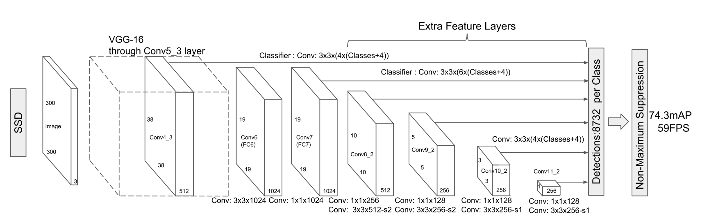

# [SSD: Single Shot MultiBox Detector](https://arxiv.org/abs/1512.02325)

Date: 12/08/2015  
Tags: task.object_detection

- The authors are motivated to develop a method for detecting objects in images using a single neural network (as opposed to the many multi-stage pipelines that already exist), with the goal of still achieving similar performance as the multi-stage pipelines 
- They propose a single neural network that eliminates bounding box proposals and the subsequent pixel of feature resampling stage (i.e. the object / region proposal phase), naming it the `Single Shot Detector (SSD)`.
    - Their network is a CNN that produces a fixed-size collection of bounding boxes and scores for the presence of object class instances in those boxes, followed by a non-maximum supression step to produce the final detections.
        - On top of a base network (e.g. VGG), they run a set of convolutional layers, each of which is used to produce a fixed set of detection predictions. In effect, they get predictions of different scales from the feature maps of different scales.
    - They formulate box prediction as regressing to offsets for the center of the bounding box (cx, cy) and for its width and height.
        - Default boxes (i.e. from the grid of boxes across the image) are matched to ground boxes first by matching the ground truth box to the default box with the best jacard overlap, and then by matching *all* default boxes to any ground truth with jaccard overlap higher than a threshold (0.5)
        - They create the default boxes for the different feature maps with varying, regularly spaced scales (going from the lowest scale in the lowest layer to the highest scale in the higher layer)
    - The overall objective loss is a weighted sum of a localization loss (L1 between the predicted and ground truth bounding box values) and a confidence loss (softmax) for predicting the class of object in the box
- They test their method on PASCAL VOC 2007, PASCAL VOC 2012, COCO, and the ILSVRC detection dataset
    - During training, they use: 
        - Hard negative mining; they sort the observations by the highest confidence loss for each default box and pick the top ones so that the ratio between the negatives and positives is at most 3:1
        - Data Augmentation; each training iamge is randomly sampled from: 
            1. Using the entire original input image
            2. Sampling a patch so that the minimum jaccard overlap with the objects is 0.1, 0.3, 0.5, 0.7, or 0.9
            3. Randomly sampling a patch
    - On PASCAL VOC 2007, they outperform both Fast R-CNN and Faster R-CNN
    - On PASCAL VOC 2012, they outperform Fast R-CNN, Faster R-CNN, and YOLO
    - On COCO, they outperform Fast R-CNN and Faster R-CNN, but it requires a 512x512 input sized model (the 300x300 doesn't outperform Faster R-CNN)
- In performing ablation experiments and / or trying to understand the performance, they learn: 
    - Compared to R-CNN, SSD has less localization error but more confusion with similar object categories
    - SSD performs relatively worse on small objects, although increasing the input size from 300x300 to 512x512  helps
    - Data augmentation is critical, and can improve mAP by ~8% (~13% relative improvement)
    - Using more default box shapes is better (they use 6, and if they use any less performance degrades)
    - Using a version of the network with atrous convolutions is faster, and performance is about the same
    - Using the multiple output layers (i.e. getting detection predictions from multiple scale feature maps) helps performance significantl
    - Implementing a "zoom-out" data augmentation to effectively create more "small object" examples improves the mAP by 2-3%, and significantly improves the sensitivity for small objects

# SSD Architecture

