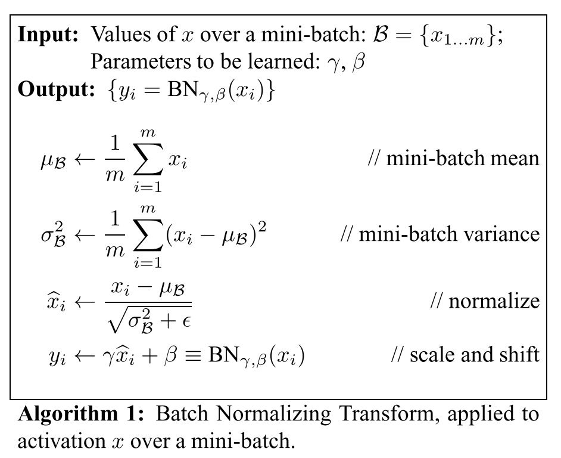

# [Batch Normalization: Accelerating Deep Network Training by Reducing Internal Covariate Shift](https://arxiv.org/abs/1502.03167)

Date: 2/11/2015  
Tags: task.object_classification

- The authors are motivated to address the problem of internal covariate shift, where the distribution of inputs to each layer in a neural network changes during training
    - This slows down training by requiring lower learning rates and careful parameter initialization
- The authors propose batch normalization to reduce internal covariate shift
    - *Internal covariate shift* is the change in the distribution of network activations due to the change in network parameters during training.
    - Whitening a network's inputs has long been known to speed up network convergence, and doing this to activations could be a step towards reducing internal covariate shift
        - Doing the whitening outside of the gradient desecent step is problematic because the gradient descent step does not take into account the whitening step, and the gradient descent step may attempt to update the parameters in a way that requires the whitening step to be updated
        - Doing the whitening within the gradient descent step by traditional means would be expensive, since it would require analysis of the entire training set at each gradient descent step. In addition, it is not everywhere differentiable.
    - With batch normalization:
        - Each scalar feature is normalized independently to have a mean of zero and a variance of one, using the means and variances *of the batch*
            - For convolutional layers, the mean and variance are calculated over all spatial locations for all observations in a batch, so that each element in a feature map has the same normalization applied
        - The transformation that is used is enabled to be able to represent the identity transform; to do this, a pair of parameters (*gamma* and *beta*) are introduced *for each scalar feature* that allow for scale and shift to be applied to the normalized value
    - For inference, the population mean and variance are used, rather than the mini-batch mean and variance
    - Batch normalization is applied right *before the nonlinearity*, which allows the bias to be ignored since its effect will be cancelled by the subsequent mean subtraction that occurs in the batch normalization step
- The authors test their method on the ImageNet challenge, and obtain SOTA
- Through training / experimentation, the authors note:
    - Using batch normalization enables higher learning rates
    - Batch normalization in a network acts as a regularizer, since the network no longer produces deterministic values for a given training example
        - When using batch normalization, dropout can be either removed or reduced in strength
    - The input distribution remains more stable throughout training when using batch normalization (demonstrated on MNIST)
    - Using batch normalization enables the following additional changes to be made
        - Increase in the learning rate
        - Removal of dropout
        - Reduction in L2 weight regularization
        - Acceleration of learning rate decay
        - Removal of the Local Response Normalization layers
        - Shuffling of training examples more thoroughly
    - Using batch normalization allows for the Inception network to be trained in roughly 1/2 the number of training steps
    - Using batch normalization and a 5x higher learning rate allows for the Inception network to be trained with roughly 1/14 the number of training steps
    - Using batch normalization and a 30x higher learning rate allows for training the Inception network to a higher level of accuracy with roughly 1/5 the number of training steps

## Batch Normalization Transformation

