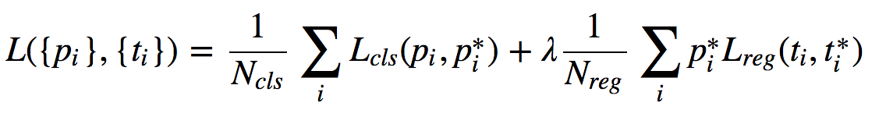

# [Faster R-CNN: Towards Real-Time Object Detection with Region Proposal Networks ](https://arxiv.org/abs/1506.01497)

Date: 06/04/2015
Tags: task.object_detection

- The authors are motivated to address the computational bottleneck in many object detection pipelines, the regional proposal stage
    - `Selective Search`, a common regional proposal method, is an order of magnitude slower than object detection methods based on neural networks (e.g. R-CNN)
- The authors propose a Region Proposal Network (RPN) that is fully convolutional:
    - It is enabled to be (a) trained end-to-end, and (b) merged with Fast R-CNN to form a single network for region proposal and object detection
    - The Region Proposal Network simultaneously regresses region bounds and objectness score (i.e. is there an object in the proposal at all) at each location on a regular grid
        - It takes as input an image and outputs a set of retangular object proposals, each with an objectness score
        - It computes a feature map using some number of convolutions, and the region proposals are generated by adding two additional layers:
            1. An *n x n* convolutional layer
            2. Two *1 x 1* convolutional layers that act as the output layers fed into the loss function. The *reg* layer has *4k* outputs encoding the coordinates of the boxes of the *k* region proposals, and the *cls* layer has *2k* outputs encoding the probability of object or not object for each proposal.
        - The region proposal network uses anchor boxes (reference boxes) at the center of each of the sliding windows in the *n x n* convolutional layer at multiple scales and aspect ratios to generate proposals. These allow for multi-scale predictions.
        - They sample positive and negative anchor boxes up to a 1:1 ratio
        - They apply non-maximum suppression to the region proposals to supress proposals with high overlap
        - The loss function is a multi-task loss defined below, where *i* is the index of an anchor in a mini-batch and *p_i* is the predicted probability of anchor *i* being an object. The ground-truth label is 1 if the anchor is positive, and is 0 if the anchor is negative. *t_i* is a vector representing the 4 parameterized coordinates of the predicted bounding box, and *t_i* is that of the ground-truth box associated with a positive anchor. They use log loss for *L_cls* and L1 for *L_reg*, and the regression loss is only activated for positive anchors. The *N_cls* is equal to the mini-batch size and the *N_reg* is equal to the number of anchor locations. Lambda is set such that the terms are roughly equally weighted.  

    

- The detection network is simply Fast R-CNN
- They combine the RPN and Fast R-CNN in a way that they share features (i.e. the convolutional layers that generate the set of feature maps used for object proposals and ROI pooling)
    - They experiment with a couple of training schemes in terms of joint training, and settle on one where:
        1. RPN is trained
        2. Fast R-CNN is trained from proposals generated by RPN.
        3. The trained fast R-CNN is used to initialized RPN, and its unique layers are fine-tuned (i.e. the shared convolutional layers are fixed).
        4. The trained fast R-CNN has its unique layers fine-tuned.
- They evaluated their method on PASCAL VOC (2007 & 2012) and MS COCO. Relative to a benchmark of using Fast R-CNN with selective search region proposals, using the RPN network to generate region proposals improves performance both in terms of mean average precision as well as runtime
- In performing ablation experiments, they learned:
    - Not sharing the feature extraction convolutional layers between the RPN and Fast R-CNN reduces performance (by ~2%)
    - Non-maximum suppression does not harm the performance
    - The object score output by the RPN matters when there are few proposals. When they ignored the object score and took a random 1k proposals (rather than the top 300), the performance didn't change too much, but when they took a random 100 it dropped significantly.
    - The anchor boxes alone (even at multiple scales and aspect ratios) are not sufficient or accurate detection. When they ignored the regression layer loss from the RPN, the performance dropped by ~6% in terms of mean average precision.
    - Using stronger networks (VGG instead of ZFNet) improves the quality of proposals and the end object detection accuracy
    - The lambda in the RPN loss doesn't impact performance too much within an order of magnitude
    - Having multiple scales appears to help more than having multiple aspect ratios

## RPN Network

<image src="./images/rpn_network.png" width=400 height=300>

## Faster R-CNN
<image src="./images/faster_rcnn.png" width=400 height=350>
