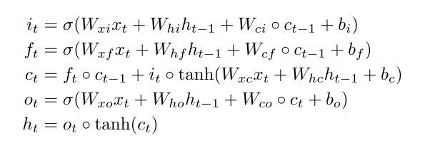

# [Convolutional LSTM Network: A Machine Learning Approach for Precipitation Nowcasting](https://arxiv.org/abs/1506.04214)

Tags: task.forecasting, domain.environmental  
Date: 06/13/2015

- The authors are motivated to extend the fully connected LSTM (FC-LSTM) to have convolutional structures in order to build an end-to-end trainable model for precipitation nowcasting
    - The goal of precipitation nowcasting is to give precise and timely prediction of rainfall intensity in a local region over a relatively short period of time (e.g. 0-6 hours)
    - By viewing precipitation nowcasting as a spatiotemporal sequence forecasting problem with a sequence of past radar maps as input and a sequence of a fixed number of future radar maps as output, the problem can be solved under the general sequence-to-sequence learning framework
- The authors propose an encoder-decoder network where both the encoder and decoder portions consist of several layers of stacked ConvLSTMs
    - The network takes as input a sequence of past radar maps and predicts as output a fixed number of future radar maps
    - The *encoding LSTM* compresses the whole input sequence into a hidden state tensor and the *forecasting LSTM* unfolds this hidden state to give the final prediction
    - The ConvLSTM is built by extending the idea of the FC-LSTM to ConvLSTM, which has convolutional structures in both the input-to-state and state-to-state transitions
- The authors test their method on a moving-MNIST dataset (to gain some basic understanding of the model) as well as a Radar Echo Dataset
    - The radar echo dataset is a subset of three-year weather radar intensities collected in Hong Kong from 2011 to 2013; they select the top 97 rainy days to form the dataset
    - The ConvLSTM based network performs better than ROVER (SOTA that is commonly used for precipitation nowcasting)
- Through training / experimentation, they note:
    - ConvLSTM is better than FC-LSTM in handling spatiotemporal correlations
    - Making the state-to-state convolutional kernel bigger than 1 is essential for capturing the spatiotemporal motion patterns
    - Deeper models can produce better results with fewer parameters
    - The ConvLSTM based network outperforming ROVER is mainly due to two reasons:
        - The ConvLSTM network is better able to handle boundary conditions well (e.g. when a cloud appears somewhat suddenly at the border of an image)
        - The ConvLSTM network is trained end-to-end and some complex spatiotemporal patterns in the dataset can be learned by the nonlinear and convolutional structure of the network (where as it is difficult, if possible, to train the ROVER method end to end)

## Network Architecture

## FC-LSTM

## ConvLSTM

