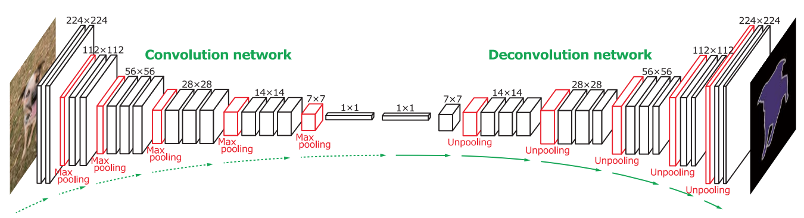
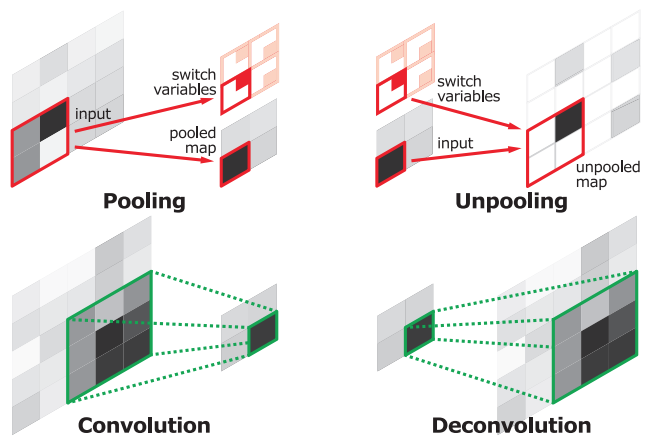
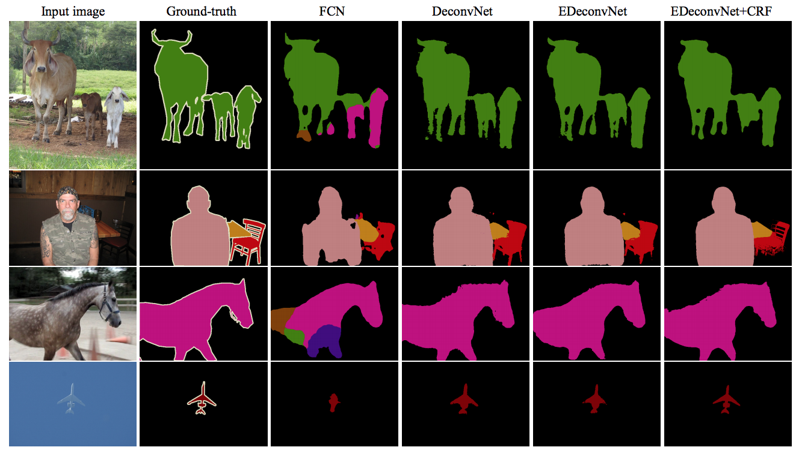

# [Learning deconvolution network for semantic segmentation](https://arxiv.org/abs/1505.04366)  

Date: 05/17/2015
Tags: task.semantic_segmentation

- The authors are motivated to address two of the main limitations of fully convolutional networks:
    1. They can handle only single scale semantics within the image due to the fixed size receptive field. They argue that skip connections are an attempt to alleviate this problem, but not a fundamental solution (and performance gains aren't that large).
    2. The detailed structures of an object are lost because of the coarse input to the deconvolutional layers and the overly simple deconvolution process.
- They learn a multi-layer deconvolutional network after the downsampling convolutional network.
    - In their deconvolutional network, they use unpooling layers that use switch variables from the pooling layers, where the switch variables store the output of the pooling (e.g. the max location in max pooling).
    - The unpooling layers are followed by convolutional layers that densify the spare output from the unpooling layers.
    - They use multiple layers of convolutions in the deconvolutional network to capture different levels of shape details; they visualize the different layers of the deconvolutional network and do find that the initial layers learn very coarse output maps and the later layers learn very detailed output maps.
- They perform instance level segmentation on object proposals and then combine them for a final segmentation mask.
    - They perform two stage training:
        1. Stage one object proposals are simply patches that are centered & cropped around object instances using ground truth annotations.
        2. Second stage object proposals are candidate object proposals (obtained from an edge detection algorithm) that sufficiently overlap with ground truth.
    - For inference, they generate a sufficient number of candidate proposals, segment those, and then obtain segmentations of each of the proposals. They combine them via pixel wise max operations.
- They perform experiments on PASCAL VOC 2012, and obtain significantly better results than FCNs.
    - Using a CRF on top of the DeconvNet improves results by ~1.5%.
    - In ensembling their approach with an FCN and using a CRF on top, they achieve SOTA. They reason that their approach is better at capturing finer details, while FCN is better at capturing global shape.

## Deconvolution Network Architecture

## Unpooling and Deconvolution Operations

## Deconvolution Network Results

