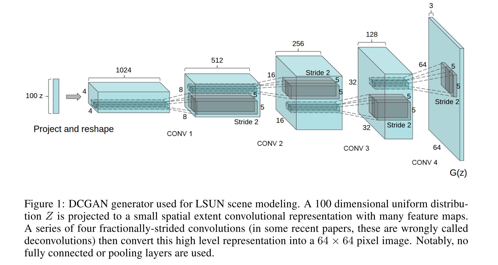
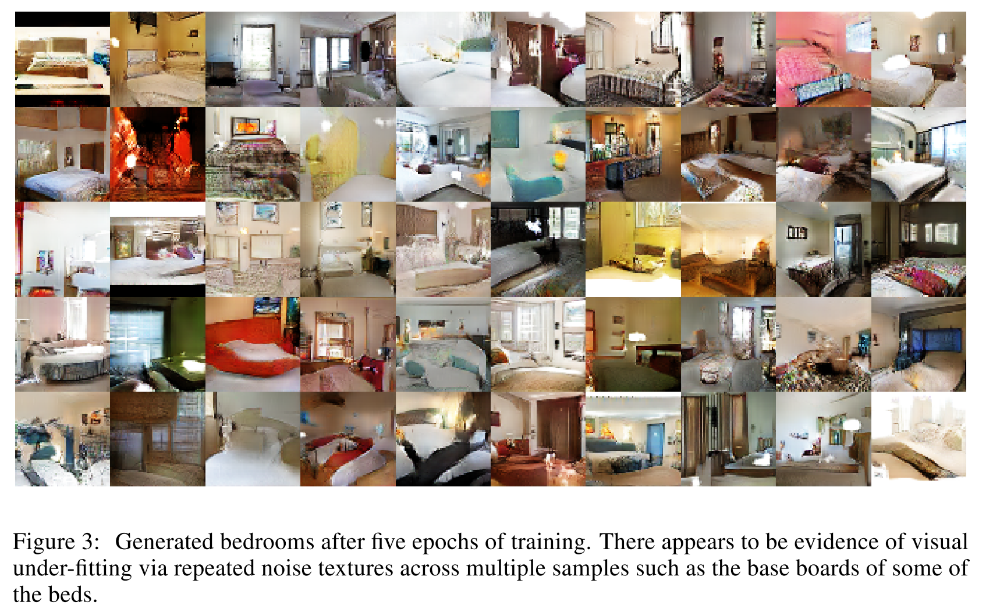
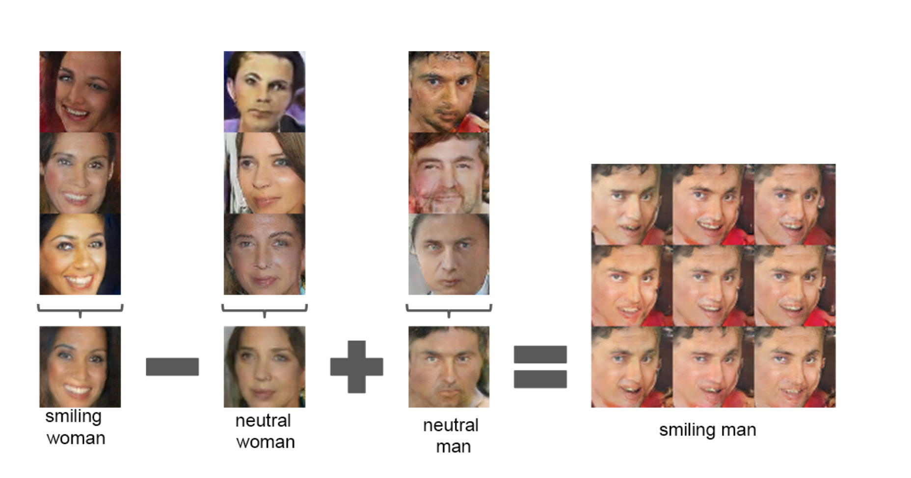
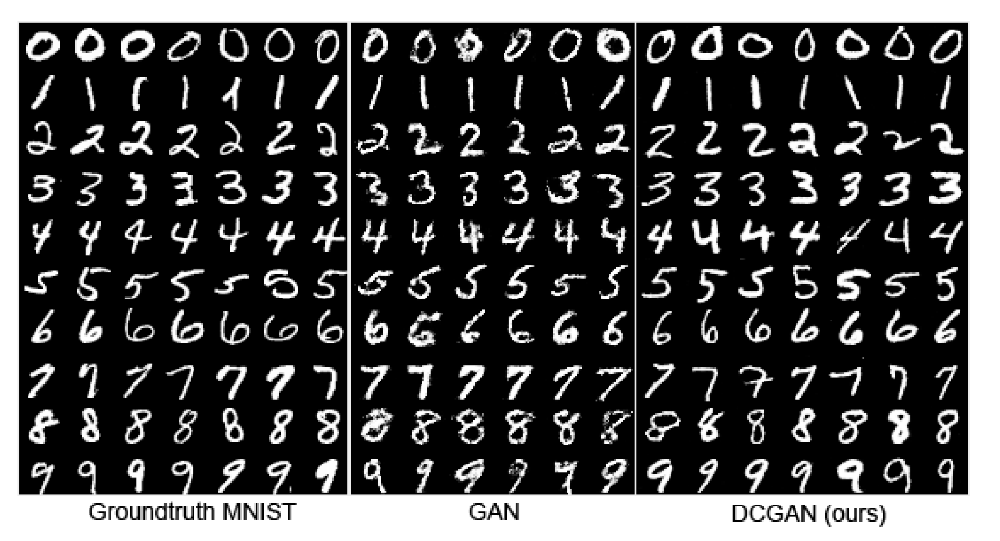

# [Unsupervised Representation Learning with Deep Convolutional Generative Adversarial Networks](https://arxiv.org/abs/1511.06434)

Date: 11/19/2015  
Tags: task.object_classification, topic.generative_adversarial_networks, topic.unsupervised_learning

- The authors are motivated to develop a class of CNNs that are a strong candidate for unsupervised learning
- The authors propose deep convolutional generative adversarial networks (DCGANs) whose discriminator component can be used for image classification tasks
    - Historically, GANs have been difficult to train, but the authors propose the following architectural guidelines for stable training of deep convolutional GANs:
        - Replace any pooling layers with strided convolutions (discriminator) and fractional-strided convolutions (generator). This allows the generator to learn its own upsampling, and the discriminator to learn its own downsampling.
        - Use batchnorm in both the generator and the discriminator. This proved critical to get deep generators to begin learning, and preventing them from collapsing all samples to a single point.
        - Remove fully connected hidden layers for deeper architectures
        - Use ReLU activation in the generator for all layers except for the output layer, which uses Tanh
        - Use LeakyReLU activations in the discriminator for all layers
- They tested the proposed guidelines by: 
    - Training GANs on the Large-scale Scene Understanding (LSUN), Faces, and Imagenet-1k datasets
    - Testing the quality of the representations learned by DCGANs for supervised tasks by:
        - Training on Imagenet-1k and using the discriminator's features to perform classification on the CIFAR-10 dataset. This achieved an accuracy that outperformed all K-means based approaches, but an accuracy that is still less than that of Exemplar CNNs.
        - Training on Imagenet-1k and using the discriminator's features to perform classification using the StreetView House Numbers dataset (SVHN). They set SOTA here.
- Through training / experimentation, they note:
    - The CNN architecture used in DCGAN is not the key contributing factor to the model's performance; when they train a purely supervised CNN with the same architecture on the same data, it achieves a significantly higher error rate than the network that uses features from the discriminator.
    - Walking in the latent space shows smooth transitions across the manifold that is learned, suggesting that the model has learned relevant and interesting representations
    - Using guided backpropagation shows that the features learned by the discriminator activate on typical parts of a bedroom, like beds and windows
    - The structure that emerges in the Z representations of the trained DCGANs supports vector arithmetic (but only when averaging the Z vector across multiple exemplars per concept)

## DCGAN Generator

## DCGAN output

## Z Representation Vector Arithmetic

## Comparison of MNIST examples from GAN and DCGAN

