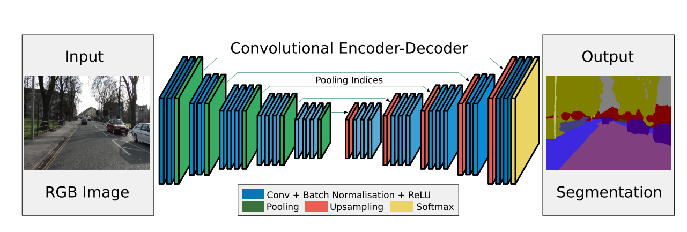

# [SegNet: A Deep Convolutional Encoder-Decoder Architecture for Image Segmentation](https://arxiv.org/abs/1511.00561)

Tags: task.semantic_segmentation  
Date: 11/02/2015  

- The authors are motivated to develop a deep fully convolutional neural network for semantic segmentation with a more robust decoder
    - They are additionally motivated to study how different parts of the decoder affect memory usage, runtime, and accuracy of the network
- The authors propose an encoder-decoder network that has a symmetric structure, ending in a pixelwise classification layer
    - The encoder network consists of the 13 convolutional layers of VGG16, and the decoder also consists of 13 layers (one for each layer in the encoding network)
    - In order to preserve the boundary details that are otherwise lost during max pooling / sub-sampling and the spatial resolution of the feature maps is reduced, they store the *max-pooling* indices of the encoding layers (i.e. the locations of the maximum feature value in each pooling window for each encoder feature map) to use in the decoding network
        - If memory is not constrained, an alternative to this is to simply store the entire encoder feature map (e.g. as in UNet)
        - The appropriate decoder in the decoder network upsamples its input feature map(s) by using the max-pooling indices from the corresponding encoder feature map(s). The upsampled feature maps are then run through a convolution to produce dense feature maps.
    - They test a number of decoder variants:
        - SegNet-Basic: consists of 4 encoding and 4 decoding layers
        - SegNet-Basic-SingleChannelDecoder: consists of 4 encoding and 4 decoding layers, but the decoder filters are single channel
        - SegNet-Basic-EncoderAddition: consists of 4 encoding and 4 decoding layers, and each decoding layer uses the max-pooling indices from the corresponding encoding layer *in addition to* the encoding layer feature map
    - They also experiment with / without class balancing
- They test their method on the CamVid dataset as well as the SUN RGB-D Indoor Scenes dataset
    - Metrics measured include the global accuracy, class average accuracy, and mean intersection over union (mIoU)
    - On both datasets, SegNet shows competitive (or superior) performance with lower memory requirements
- Through training / experimentation, they note:
    - Bilinear-upsampling without any learning performs the worst across all measures of performance, emphasizing the need *to learn* decoder networks for segmentation
    - SegNet-Basic performs equally well compared to FCN-Basic (Fully Convolutional Network implementation), but uses less memory at the cost of taking more time during the forward pass
        - SegNet-Basic uses less memory by storing the pooling indices, but contains a greater number of filters in the decoding layers, leading to a larger network
    - Using information from the encoding network is critical, and the best performance is achieved when encoder feature maps are stored in full
        - When FCN-Basic does not use the encoder feature maps (i.e. FCN-Basic-NoAddition), its performance is worse
        - When SegNet-Basic uses the encoder feature maps (i.e. SegNet-Basic-EncoderAddition), its performance is better
    - When memory during inference is constrained, then compressed forms of encoder feature maps (e.g. using dimensionality reduction or max-pooling indices) can be stored and used with an appropriate decoder to improve performance
        - If memory is not constrained during inference, retaining the details from the higher resolution feature maps is beneficial
    - Without class balancing (using natural frequency instead), all variants of both network types perform worse
    - Relative to other semantic segmentation networks, SegNet performs well at segmenting smaller classes while still producing a smooth segmentation of the overall scene (at least for the CamVid dataset)
    - SegNet produces fairly smooth segmentations, comparable to other methods that use a conditional random field (CRF) for post-processing
    - When end-to-end training is performed with the same and fixed learning rate, smaller networks like SegNet learn to perform better in a shorter time

## SegNet Architecture

