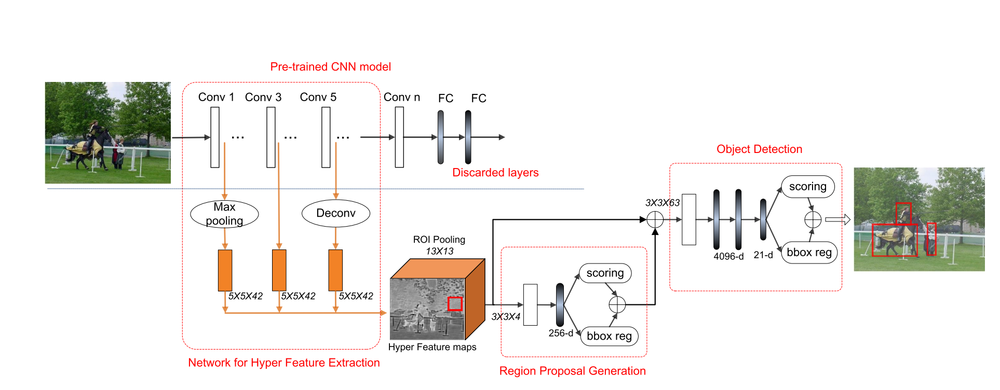

# [HyperNet: Towards Accurate Region Proposal Generation and Joint Object Detection](https://arxiv.org/abs/1604.00600)

Date: 04/03/2016  
Tags: task.object_detection

- The authors are motivated to improve the quality of region proposals in object detection systems, thus reducing the number of necessary region proposals to achieve good performance
- The authors propose a heirarchical network (HyperNet) to generate region proposals that can then be passed to an object detection network. It consists of several parts:
    1. Hyper Feature Production - This computes feature maps over an entire image, and the resulting feature maps from different convolutional layers are resampled (e.g. through max pooling or deconvolution) to allow for final concatenation of the multi-scale feature maps (into a `HyperFeature` cube).
    2. Region Proposal Generation - This consists of a lightweight CNN that consists of an ROI Pooling layer, a Conv layer, and a Fully Connected Layer. It produces predictions for whether or not there is an object in the region proposal and bounding box coordinates. A non-maximum supression algorithm is applied to the remaining regions based off of their objectness scores.
        - They use a multi-task loss that is a weighted combination of a regression loss (smoothed L1 between the predicted and ground truth (x, y) center and the width and height) and a softmax loss for object or not
    3. Object Detection Layers - This is just two Fully Connected layers (with dropout in-between) that produce predictions for object classes as well as bounding box coordinates.
        - They use a multi-task loss that is a weighted combination of a regression loss (smoothed L1 between the predicted and ground truth (x, y) center and the width and height) and a softmax loss for the classes
- They evaluate their method on PASCAL VOC 2007 and 2012
    - They assign positive labels to a box that has an IoU threshold higher than 0.45 with any ground truth box and a negative label to a box if its IoU threshold is lower than 0.3 with all ground truth boxes.
    - They train using an alternate scheme before training the two networks together.
    - On VOC 2007, they have improved performance when compared to Fast R-CNN and Faster R-CNN. It's a little hard to tell if the comparison is apples to apples, but it looks like they also have better performance than the equivalent comparison made in the SSD paper.
    - On VOC 2012, they also show improved performance when compared to Fast R-CNN and Faster R-CNN. Again, it's a little hard to tell if the comparison is apples to applies, but it looks like they have worse performance than the equivalent comparison made in the SSD paper.
- Through experimentation and such, they note / show:
    - Their proposal method gets much higher recall than other methods, namely RPN, Selective Search, and Edge Boxes
    - The recall of their proposal method does not drop as much as RPN when the IoU threshold to define a match increases (e.g. from 0.5 to 0.7)
    - Combining layers for the HyperFeature cube is beneficial, although it doesn't add too much benefit over just selecting the last layer and using it for region proposals (although this set of experiments was done with AlexNet)
    - They could speed up training by moving the conv after the ROI pooling to before the ROI pooling

## HyperNet Architecture 

