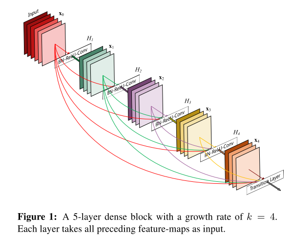

# [Densely Connected Convolutional Networks](https://arxiv.org/abs/1608.06993)

Tags: task.object_classification  
Date: 08/25/2016

- The authors are motivated to develop a network that has shorter connections between layers close to the input and those close to the output 
    - Many recently successfully developed networks create short paths from early layers to later layers
- The authors propose a network, DenseNet, that connects *all layers* (with matching feature-map sizes) directly with each other
    - In each dense block (i.e. all convolutional layers at a single resolution), each layer receives the feature maps produced in all previous layers concatenated together
    - Transition layers that perform convolution and pooling are used to transition from one dense block (with larger feature maps) to another dense block (with smaller feature maps)
    - Hyperparameters that they search over include:
        - Growth rate: the number of feature maps that each convolutional layer produces
        - Compression factor: the ratio of how many feature maps a transition layer will output relative to how many feature maps it recieves as input
        - Bottleneck convolutions: whether or not to use 1x1 convolutions before 3x3 convolutions
- They test their method on CIFAR 10 / 100, Street View House Numbers (SVHN), and ImageNet
    - On CIFAR 10 / 100, they set SOTA
    - On SVHN, they set SOTA
    - On ImageNet, they perform on par with SOTA with significantly fewer parameters (DenseNet with ~20 million parameters yields similar results to a ResNet with ~40 million parameters)
- Through training / experimentation, they note:
    - DenseNets allow for more efficient training because they alleviate the vanishing-gradient problem, strengthen feature propagation, encourage feature reuse, and substantially reduce the number of parameters
    - Because each individual layer receives input from all previous layers, each layer can be much more narrow (e.g. 12 filters) than layers in other networks
    - Without compression or bottleneck layers, there is a general trend that DenseNets perform better as the number of layers increases and as the growth rate increases. This is primarily due to model capacity
    - DenseNets use parameters more efficiently than alternative architectures (in particular, ResNets); their ~15 million parameter DenseNet consistently outperforms ~30 million parameter FractalNet and Wide ResNet implementations
    - DenseNets are less likely to overfit, as demonstrated by being significantly better than prior work when training is performed *without* data augmentation
    - One explanation for the improved performance is that DenseNets implicitly build in deep supervision

## Dense block

## DenseNet Architecture

