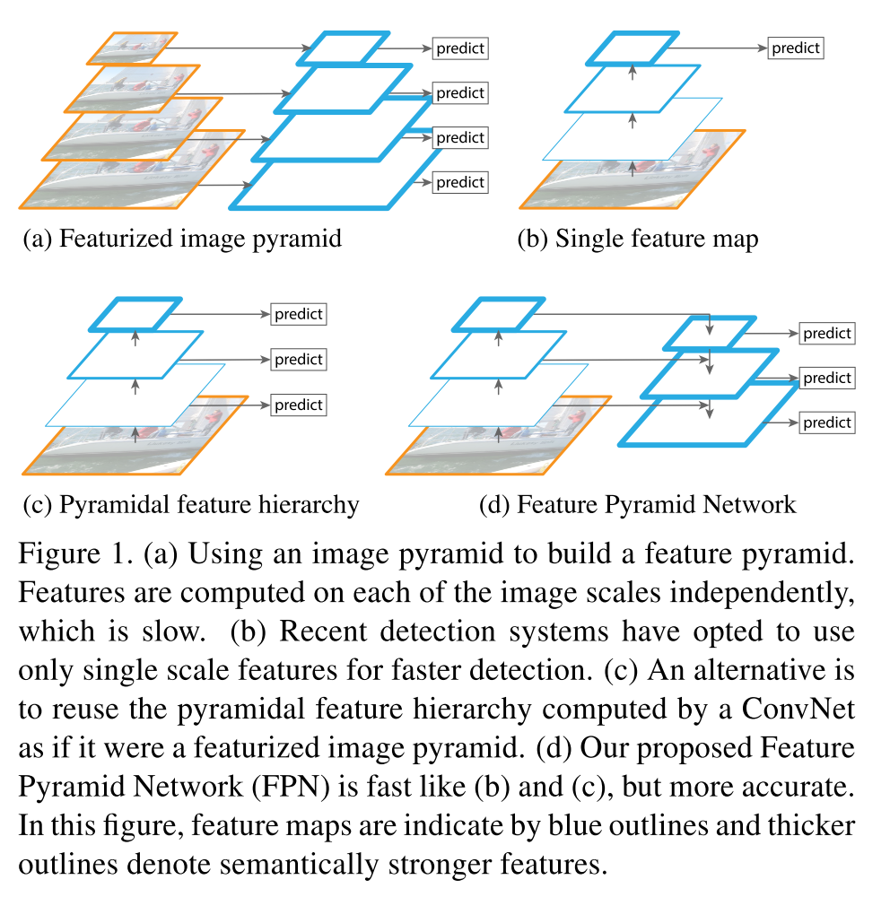
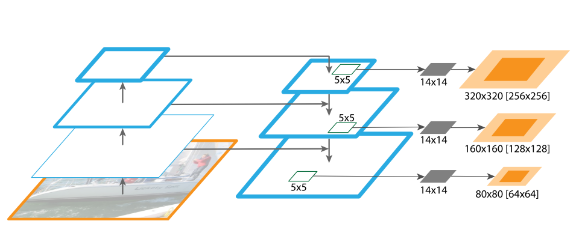

# [Feature Pyramid Networks for Object Detection](https://arxiv.org/abs/1612.03144)

Date: 12/9/2016  
Tags: task.object_detection, task.instance_segmentation

- The authors are motivated to develop a more efficient way of generating feature pyramids, as they are a basic component in object detection systems that enable detecting objects at different scales
- The authors propose using the image pyramid that is naturally created in most convolutional architectures to construct feature pyramids at marginal extra cost. They deem they their method the Feature Pyramid Network:
    - Convolutional networks compute a feature hierarchy layer by layer, and with subsampling layers the feature hierarchy has an inherent multi-scale, pyramidal shape
    - The network takes a single-scale image as input, and outputs proportionally sized feature maps at multiple levels in a fully convolutional fashion. It consists of a bottom-up pathway, a top-down pathway, and lateral connections.
        - The bottom-up pathway is the feed-forward computation of a "backbone" ConvNet. Each "stage" of the bottom-up pathway is one in which all feature maps are the same size (i.e. in between successive pooling layers). They define one pyramid level for each stage, and take the output of the last layer of each stage as the reference set of feature maps to create the pyramid.
        - The top down pathway produces higher resolution features by upsampling feature maps from the pyramid levels (using nearest neighbor interpolation), which are enhanced vid addition with features from the bottom-up pathway via lateral connections (which go through a 1x1 convolutional layer to reduce channel dimensions).
    - They implement their proposed feature pyramids within the scope of several tasks, namely as a region proposal network, within the Fast R-CNN paradigm for object detection, and instance segmentation
        - For a regional proposal network, they simply adapt the Region Proposal Network from Faster R-CNN to take as input the feature pyramid, and attached a head to each layer of the feature pyramid (the head is of the same form as the RPN in Faster R-CNN)
            - Since the feature pyramid is inherently multi-scale, they only assign anchors of a single scale to each level of the pyramid
            - An anchor is assigned a positive label if it has the highest IoU for a given ground-truth box or an IoU over 0.7, and a negative label if it has IoU lower than 0.3 for all ground-truth boxes
        - For object detection with Fast R-CNN, they assign each RoI to a certain level of the feature pyramid based off its width and height. They then attached predictor heads (class-specific classifiers and bounding box regressors) to all RoIs of all levels, where the heads all share parameters.
            - These predictor "heads" consist of an RoI pooling to extract 7x7 features followed by two fully connected layers that feed into the final output layers
        - For instance segmentation, they introduce a fully convolutional network on top of each level of the pyramid
- They test their method on COCO object detection and instance segmentation, and find that they obtain the best *single-model* results for the object detection benchmark, and the best results *on the first 5k COCO val images* when assessing the average recall on instance segmentation proposals
- Through experimentation, they note:
    - Their feature pyramid network greatly improves the average recall of the region proposal network relative to using a single scale, as well as the average precision of object detection with Fast R-CNN
    - The top-down enrichment and lateral connections are both important for performance, and without them the average recall of the regional proposal networks is noticeably worse, as does the average precision of object detection with Fast R-CNN
    - Using only the finest level of resolution (P2) for object detection with Fast R-CNN performs quite well (almost as well as using the entire pyramid) if using the feature pyramid for the object proposals

## FPN Compared To Prior Work

## FPN For Instance Segmentation

