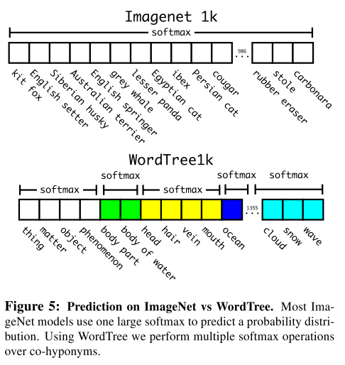

# [YOLO9000: Better, Faster, Stronger](https://arxiv.org/abs/1612.08242)

Date: 12/25/2016  
Tags: task.object_detection, topic.efficiency

- The authors are motivated to build a state-of-the-art, real-time object detection system that can detect loads (9000) of object categories, and at the same time address the shortcomings of YOLO
    - They are motivated in part to address the fact that the datasets for object detection typically have many fewer classes than the datasets for classification, which leaves object detection operating at a much smaller scale than object classification
    - The shortcomings of YOLO include a large number of localization errors as well as relatively low recall compared to region proposal-based methods
- The authors propose a new method to use the large amounts of classification data available to expand the scope of current detection systems; they aim to leverage labeled detection images to learn to localize objects while using the classification images to increase the vocabulary and robustness of detection systems
    - They design a new classification model (Darknet-19) to use as the base of YOLOv2
        - It uses mostly 3x3 filters and doubles the number of channels after every pooling step, and 1x1 filters to compress the feature representation between 3x3 convolutions
        - It uses global average pooling to make predictions
        - It uses batch normalization to stabilize training, speed up convergence, and regularize the model
    - For the detection model, they alter the classification model by removing the last convolutional layers and adding on three 3x3 convolutional layers with 1024 filters, each followed by a final 1x1 convolutional layer with the number of outputs needed for detection
    - Using images labeled for detection to learn detection-specific information (e.g. bounding box coordinate prediction and objectness score) and image class labels to expand the number of categories it can detect, they mix training between images from both detection and classification datasets
        - When the network sees a classification image they only backpropagate loss from the classification-specific parts of the architecture
        - To deal with the fact that detection datasets have only common objects while classification datasets have a much wider range of classes, they build a hierarchical tree from the concepts in ImageNet. During training, they then propagate ground truth labels up the tree, e.g. if an image gets labelled as a "Norfolk terrier" it also gets labeled as a "dog" and a "mammal"
            - To compute the loss they use a softmax over all synsets that are hyponyms

- The authors test their proposed method using a dataset that combines the COCO detection dataset and the top 9000 classes from the full ImageNet release
    - They achieve competitive results on COCO test set for 2015 and PASCAL VOC 2012
    - They achieve SOTA on PASCAL VOC 2007
- Through training / experimentation, they note:
    - Adding batch normalization on all convolutional layers improves mAP by more than 2%
    - Pre-training ImageNet on full resolution images (448x448 instead of 224x224) increase mAP by almost 4% 
    - Removing the fully connected layers from YOLO and using anchor boxes to predict bounding boxes yields a small decrease in mAP (~0.4%), but a large jump in recall (8.6%)
    - Running k-means on the training set bounding boxes to select good priors (rather than hand-picked priors) yields much better anchor boxes (5 good priors gets roughly the same average IOU as 9 anchor boxes)
    - Directly predicting location coordinates of the bounding boxes relative to the location of the grid cell *instead* of predicting offsets greatly improves training stability
    - Using finer grained features for classification improves mAP by ~1%
        - To get finer grained features, they take features from a higher resolution layer (i.e. 26x26) features and reformulate the extra spatial dimensions to concatenate that feature map onto the 13x13 grid they predict on (i.e. the 26x26x512 becomes 13x13x2048)
    - Using multi-scale training allows the network to predict detections at different resolutions
        - To perform multi-scale training, they randomly choose a new image dimension size every 10 batches, and resize the network to that dimension on the fly
