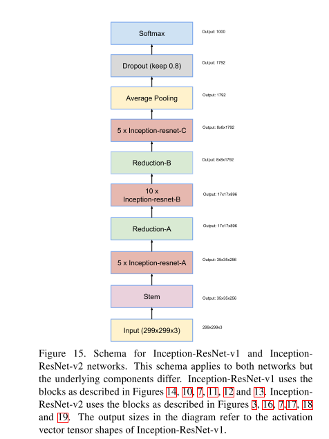

# [Inception-v4, Inception-ResNet and the Impact of Residual Connections on Learning](https://arxiv.org/abs/1602.07261)

Date: 02/23/2016  
Tags: task.object_classification  

- The authors are motivated to determine if there is any benefit in combining the Inception architecture with residual connections
- The authors propose a new version of the Inception network (Inception-v4) that integrates residual connections, and has a more uniformly simplified architecture and more inception modules than Inception-v3
    - Inception-v3 inherited a lot of baggage of the earlier incarnations, where the authors had been relatively conservative about changing the architecture and restricted experiments to varying isolated network components. Inception-v4 shed the unnecessary baggage and made uniform choices for the Inception blocks for each grid size.
    - The residual versions of the Inception networks use cheaper Inception blocks than the original Inception
    - The residual versions of the Inception networks use batch-normalization only on top of the traditional layers, but not on top of the summations. This was done to keep the memory footprint low, which allowed for increasing the overall number of Inception blocks substantially.
- The authors tested their method on ImageNet, and one of their ensembles achieved SOTA
- Through experimentation / training, they note:
    - The use of residual connections is not *necessary* for training very deep convolutional models, but it does improve the training speed greatly
    - If the number of filters exceeded 1000, the residual variants started to exhibit instabilities and the network just "died" early in training. Lowering the learning rate and adding an extra batch-normalization layer did not seem to prevent this from happening, but scaling the residuals before adding them to the previous layer did stabilize the training (they used scaling factors between 0.1 and 0.3).

## Inception ResNet

