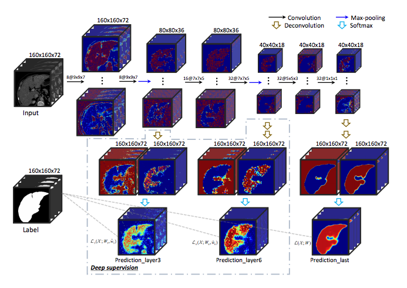

# [3D Deeply Supervised Network for Automatic Liver Segmentation from CT Volumes](https://arxiv.org/abs/1607.00582)

Tags: task.semantic_segmentation, domain.medical, topic.deep_supervision

- Motivated to build an automated way of segmenting whole liver in CT without using hand-crafted features (i.e. shape priors) and while taking into account 3D 
    - They introduce deep supervision to accelerate the optimization process and improve prediction accuracy
- They test on the [MICCAI-SLiver-07](http://www.sliver07.org/miccai.php) dataset, building a 3D FCN with 11 layers
    - 6 convolution, 2 max pooling, 2 deconvolution, and 1 output layer (i.e. softmax)
    - Used "large kernel sizes" (2 x 2 with stride of 2)
    - Used cross-entropy as the loss
    - Deep supervision was used after the 3rd and 6th layers (2 of the downsampling layers), where the output of those layers was run through de-convolutional layers to upsample them to the output resolution
        - They used balancing weights on the outputs of the deep supervision layers; they were initialized to 0.3 and 0.4 and decayed by 5% every ten epochs
   - They tested both with and without a 3D CRF layer added on top of the softmax (this improved performance by 9-57% depending on the metric, and improved the baseline CNN as well as the deeply supervised network)
- They saw improved convergence speed as well as improved performance compared to a baseline CNN without deep supervision
    - Performance increases of 15-25% across different metrics when using LOOCV 
    - Performance increases were not as large when using a 3D CRF on top of the output layer predictions
    - Similar improvements on the test set over existing methods on *some metrics*, but similarly worse performance on other metrics on the test set compared to existing methods
- This paper was after UNet, so it's unclear why they didn't use that as a baseline, but that would have been nice.

## Deep Supervision

