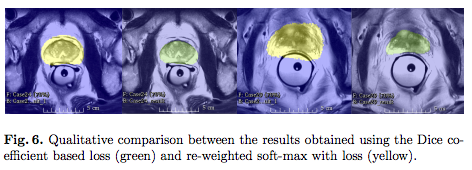

# [V-Net: Fully Convolutional Neural Networks for Volumetric Medical Image Segmentation](https://arxiv.org/abs/1606.04797)

Date: 06/15/2016  
Tags: task.semantic_segmentation, domain.medical

- The authors are motivated to use 3D fully convolutional networks for medical image segmentation, since medical imaging often consists of 3D images
    - 3D has the advantage of providing additional context that is not available in 2D
    - 3D has the disadvantages that it is (a) more likely to overfit, since it has more parameters, and likely involves less data (if you have 3D volumes you could likely slice it into 2D, which would mean more training examples), and (b) computational complexity that likely means greater memory requirements and / or longer training times; it might also mean additional overhead in terms of development / iteration
- They propose a [3D U-Net]() like architecture that has contracting and expanding paths with skip connections in between
    - They pass full resolution feature maps through the skip connections
    - Each "convolutional block" in the contracting and expanding paths is a residual block that consists of 1-3 convolutional layers (they use a sum operation for combining the residual), followed by a down / up conv. (stride of 2, in lieu of using max pooling or upsampling)
    - As in U-Net, they double the number of feature maps per convolutional block
    - They use PReLu non linearities throughout the network
    - They propose training with dice loss, and offer an implementation that is differentiable. This is in lieu of training with a weighted binary cross-entropy
    - They use 5x5x5 filters using a stride of 1 for the convolutional layers
- They test their network on the PROMISE 12 dataset whose task is prostate segmentation
    - They train with batch size 2
    - They normalize their images using N4 bias correction
    - They don't outperform other methods, although they rank fairly high (and their performance is close to other methods), but they perform inference in 1 second (but don't talk about how fast inference for other methods is)
    - They claim that the skip connections improve the accuracy and convergence time of the model, but don't offer any evidence to support that
    - They also claim that the residual connections improve the convergence time of the model, but don't offer any evidence to support it

## VNet

## Weighted Cross-Entropy Versus Dice

