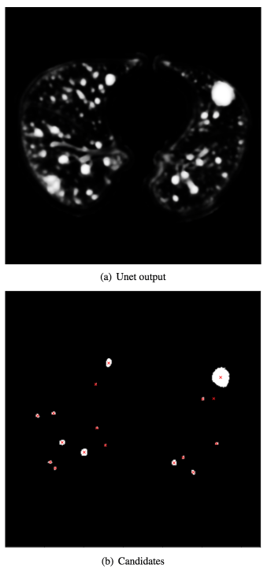

# [ZNET - LUNG NODULE DETECTION](http://luna16.grand-challenge.org/serve/public_html/pdfs/ZNET_NDET_160831.pdf/)

Date: 06/30/2016  
Tags: task.object_detection, domain.medical

- The authors are motivated to develop a detection algorithm for lung nodules
- The authors propose a two stage pipeline:
    1. Nodule candidate selection: A 2D UNet is used to generate segmentation maps for each slice, where the foreground class is the nodule segmentation mask.
        - After segmentation, each slice is threshold and eroded with a 3x3 kernel
        - After erosion, the candidates are grouped together using connected component analysis (including distance merging)
    2. False Positive Reduction Network: A 2D wide residual network was trained to predict the probability that a candidate from the first stage was a nodule.
        - The network takes in a single slice at a time, but they train on three slices per nodule (one orthogonal to the x-axis, one orthogonal to the y-axis, and the other orthogonal to the z-axis). At test time they take the mean of these probabilities
- They test their method on the LUNA challenge dataset
    - The nodule candidate selection network achieves a precision of 0.00509 and a recall of 0.95946
    - They achieved a score of 0.812 for the nodule detection track and a score of 0.758 for the false positive reduction track 

## Candidate Generation

