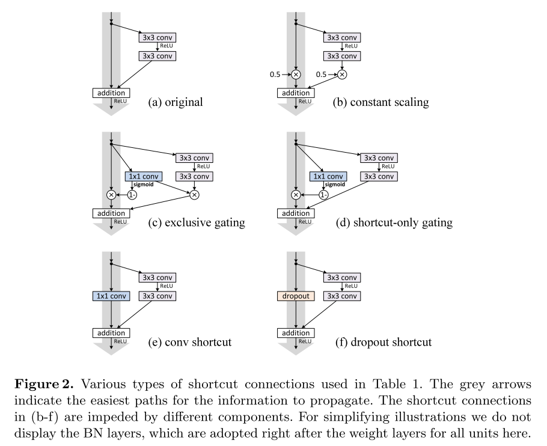
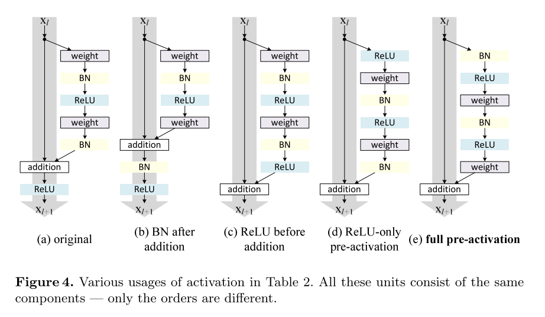

# [Identity Mappings in Deep Residual Networks](https://arxiv.org/abs/1603.05027)

Tags: task.object_classification  
Date: 03/16/2016

- The authors are motivated to study the propagation formulations behind residual blocks, and in particular to create a "direct" path for propagating information through the entire network (and not just through a single residual unit)
- They propose investigating the impact of two conditions, using CIFAR 10 / 100 and ImageNet to test on:
    - The identity skip connection, i.e. the lack of anything applied to the input of a residual unit before it is added to the result of the residual function. This is present in the original residual unit.
        - They investigate this using a number of different types of residual units (constant scaling, exclusive gating, shortcut-only gating, 1x1 convolutional shortcut and dropout shortcut); these are mostly different in that they apply some number of operations to the residual unit input *before* it is summed with the residual function output.
        - In each of the units they investigate, the additional operations simply hamper information propagation, lead to optimization issues, and lower training loss (at least one of the units has trouble converging at all in some cases)
    - The function applied to the sum of the input to the residual unit and the output of the residual function. In the original residual unit, this is a ReLU activation function.
         - They investigate this by re-arranging the activation functions (ReLU and / or BN) that are applied in a residual unit (BN after addition, ReLU before addition, Post-activation, pre-activation)
         - They find that the pre-activation improves the results the most, and its performance improvements are most noticeable with very deep networks (i.e. 1001-layer ResNet).
- They test their best residual unit on CIFAR 10 / 100, as well as ImageNet:
    - Their best residual unit shows significant gains compared to the original residual unit on all datasets
- Through training / experimentation, they note: 
    - The pre-activation unit improves performance because (a) it acts as an identity mapping and eases optimization, and (b) using BN as pre-activation improves regularization of the models, resulting in less overfitting and better generalization error
    - Identity shortcut connections and identity after-addition activation are essential for making information propagation smooth

## Proposed Units with Impediments Added to the Identity Connection

## Proposed Units with Original Unit elements Rearranged

