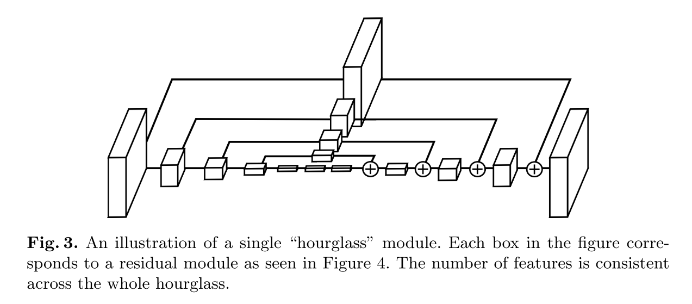

# [Stacked Hourglass Networks for Human Pose Estimation](https://arxiv.org/abs/1603.06937)

Date: 03/22/2016  
Tags: task.pose_estimation, topic.deep_supervision

- The authors are motivated to develop a robust pose estimation system that is able to capture information at multiple scales
- The authors introduce a novel "stacked hourglass" network design that captures and consolidates information across all scales of an image
     - A single hourglass network pools down to very low resolution, then upsamples and combines features across multiple resolutions; it differs from prior work in that it produces pixel-wise outputs using a symmetric topology
        - The network does not use unpooling or deconv layers, but relies on nearest neighbor upsampling and skip connections for top-down processing
        - The network reaches its lowest resolution at 4x4 pixels
        - The topology of the network is symmetric - for every layer present on the way down there is a corresponding layer going up
        - The network makes extensive use of residual modules
        - Filters greater than 3x3 are never used
    - To allow for repeated bottom-up, top-down inference across scales, the authors place multiple hourglass networks together end-to-end
        - A good amount of prior work operates in an iterative fashion to refine predictions, but often this refinement is performed only within a local window. Stacked hourglass networks allow for refinement using a global window.
        - Intermediate predictions are generated after passing through each individual hourglass network, and a loss is applied on the intermediate heatmap that is generated
        - In the final design, eight hourglasses are used
- The authors evaluate their network on the FLIC and MPII Human Pose datasets
    - The networks are trained to exclusively annotate the person in the direct center
    - They achieve SOTA across all joints on the MPII dataset
    - Their results on FLIC are very competitive
- Through training / experimentation, they note:
    - Stacking hourglass networks does offer a modest improvement in final performance
        - The increase in final performance from 2 to 4 to 8 hourglass networks is 87.4% to 87.8% to 87.1%
    - Using intermediate supervision also offers a modest improvement in final performance
    - In ambiguous situations (e.g. two people in the image), the network correctly learned to provide annotations for the person in the center of the image
    - As expected, performance on occluded joints is much lower than on joints that are clearly visible

## Hourglass module

