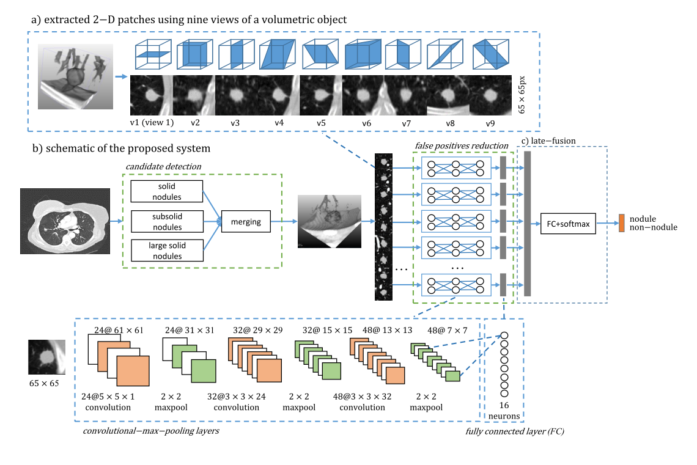

# [Pulmonary nodule detection in CT images: false positive reduction using multi-view convolutional networks](http://luna16.grand-challenge.org/serve/public_html/pdfs/DIAG_CONVNET_2C_FPRED.pdf/)

Date: 05/01/2016  
Tags: task.object_classification, domain.medical

- The authors are motivated to develop a network that classifies lung nodule candidates as true nodules or false positives
- They propose a multi-view CNN that takes in 9 extracted planes and produces a classification score for whether a nodule candidate is a true nodule or a false positive
- They test their proposed method in the LUNA false positive reduction track

Note: This paper was very light on the details, and I couldn't seem to find a copy of the referenced paper online, which presumably has more detail.

## Multi-View CNN

