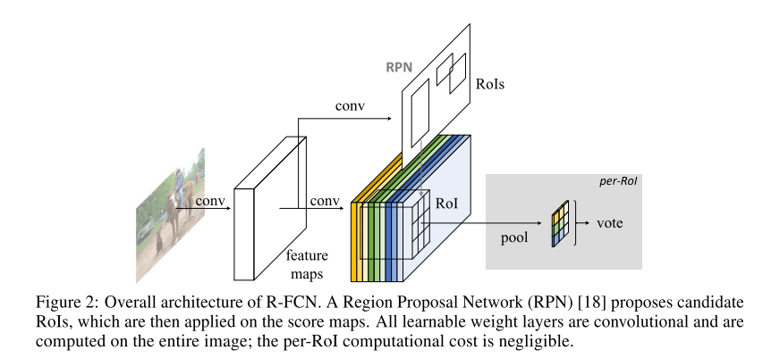

# [R-FCN: Object Detection via Region-based Fully Convolutional Networks](https://arxiv.org/abs/1605.06409)

Date: 05/29/2016  
Tags: task.object_detection

- The authors are motivated to develop an object detection pipeline that is learned in an end-to-end, fully convolutional manner
- They propose a fully convolutional detection network that takes region proposals from a region proposal network, where the detection network and region proposal network do have some shared set of features (as in Faster R-CNN)
    - The backbone (i.e. shared set of features) they use is based on ResNet-101
    - The region proposal network takes the same general form of that of Faster R-CNN (small CNN that regresses to bounding box coordinates and objectness score), although its exact architecture might be a little different.
    - The detection network takes in position sensitive score maps and ROIs to produce its detections
        - The position sensitive score maps are the backbone feature maps with a convolution applied to produce `k * k` score maps, where each position in the score map is ultimately mapped to an equivalent position in the proposed ROI. Spatially, each position in the score map describes a relative position in the proposed ROI (e.g. top-left, top-center, etc.)
            - It's a little hard to tell exactly how the classification and regression output are construct, but it sounds like the classification output is built on top of convolution that produces C + 1 sets of the k * k score maps and the regression output is built on top of a convolution that produces 4 sets of k * k score maps
        - The ROI pooling happens in such a way that for the (i, j)-th bin, the pooling operation pools only over the (i, j)-th score map, i.e. each k * k bin aggregates responses from only *one* score map. They use average pooling throughout the paper.
- They test their method on PASCAL VOC 2007, PASCAL VOC 2012, and MS COCO
    - They trained both single and multi-scale versions
    - On PASCAL VOC 2007, they find that their method performs a little bit worse (2.3%) than Faster R-CNN +++ (it uses iterative box regression, context, and multi-scale testing), but performs much faster (~20x faster)
    - On PASCAL VOC 2012, they again find that it performs a little bit worse (2.5%) than Faster R-CNN +++, but again 20x faster
    - On COCO, they find that it performs ~10% worse than Faster R-CNN +++ (for overall AP), but is about 2.5x faster
- Through experimentation, they note:
    - More depth in the ResNet backbone improves performance up to a point (improves from 50 to 101, but is saturated by depth of 512)
    - There are only small performance drops (~2%) when using Selective Search or Edge Boxes instead of the regional proposal network for object proposals
    - Using multiple scales improves performance
    - When they set k=1 (instead of the 3x3 or 7x7 used for successful experiments), they network is unable to converge

## R-FCN Architecture

## R-FCN classification prediction

