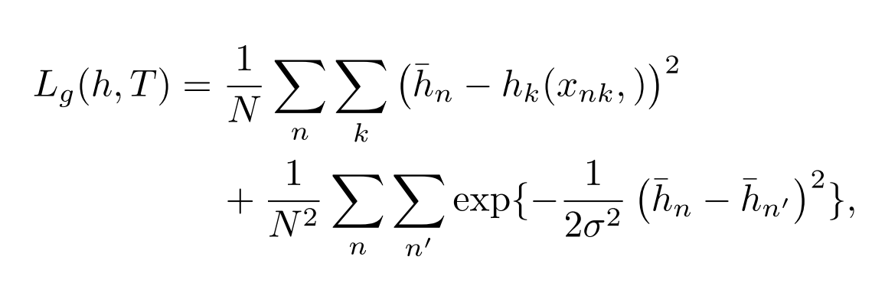
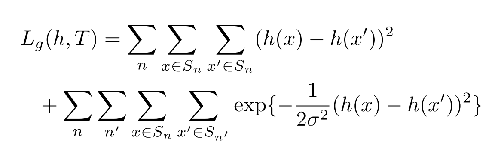

# [Associative Embedding: End-to-End Learning for Joint Detection and Grouping](https://arxiv.org/abs/1611.05424)

Date: 11/16/2016  
Tags: task.pose_estimation, task.instance_segmentation

- The authors are motivated to develop a method that simultaneously provides detections as well as grouping assignments
    - Most existing work performs these tasks separately in two stage pipelines, which may be problematic since the two are usually tightly coupled
- The authors propose using associative embeddings to identify the group a detection belongs to, and training a network to encourage pairs of tags to have similar values if the corresponding detections belong to the same group and dissimilar values otherwise
    - The absolute value of the tags doesn't matter, but only the distance between the tags
    - The authors build their associative embeddings into a stacked hourglass network and test it on tasks of human pose estimation as well as instance segmentation
        - In addition to the network producing some sort of object detection heatmap at each pixel location, it also produces a "tag" heatmap that assigns each pixel location to a specific group
        - To train the network they use a detection loss on the detection heatmaps as well as a grouping loss on the tag heatmaps
            - The detection loss is a mean squared error between each predicted detection heatmap and its "ground truth" heatmap, which consists of a 2D gaussian activation at each keypoint location
            - For the group loss of multiperson pose estimation, the grouping loss consists of two components, each based off a reference embedding calculated as the mean of the predicted tagging heatmap:
                - Within an individual, a squared distance between a reference embedding and the predicted embedding for each joint
                - Between pairs of people, a comparison of the reference embeddings to each other with a penalty that drops exponentially to zero as the distance between the two tags increases
            - For the group loss of instance segmentation, the grouping loss consists of two components:
                - Within a single instance, a pairwise squared distance error across a group of randomly sampled pixels in that instance
                - Across instances, a pairwise comparison bewteen randomly sampled pixels of the two instances with a penalty that drops exponentially to zero as the distance between the two tags increases
- They test the proposed method on multiperson pose estimation as well as instance segmentation tasks
    - For multiperson pose estimation, they use the MS-COCO and MPII datasets, and set SOTA on both.
    - For instance segmentation, they use PASCAL VOC 2012, and just aim to show that associative embeddings can work for this type of task as well.
- Through training / experimentation, they note:
    - For multiperson pose estimation, keypoint detection is the bottleneck in their system (as opposed to the grouping). Average precision increased from 59.2 to 94.0 when the predicted keypoint detections were replaced with the ground truth.

## Associative Embedding Loss for Keypoint Detection

## Associative Embedding Loss for Instance Segmentation

