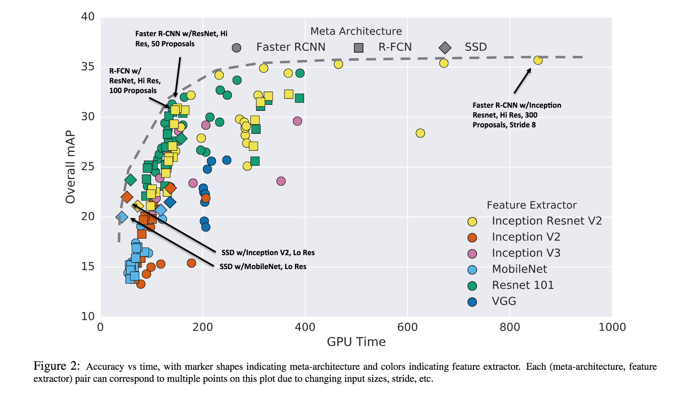
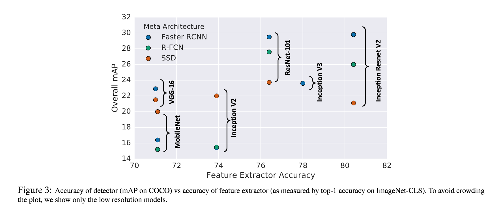
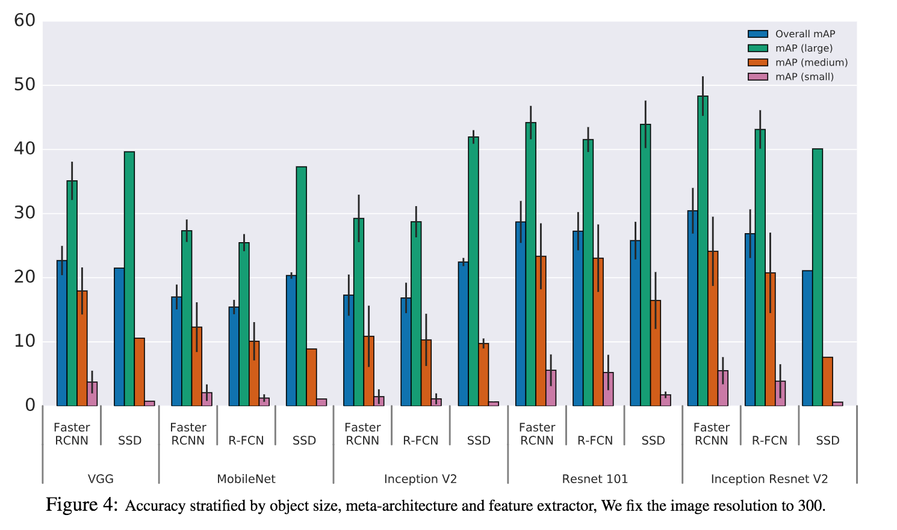

# [Speed/accuracy trade-offs for modern convolutional object detectors](https://arxiv.org/abs/1611.10012)

Date: 11/30/2016  
Tags: task.object_detection, topic.survey_papers

- The authors are motivated to investigate various ways to trade accuracy for speed and memory usage in modern object detection systems; they build a speed / accuracy trade-off curve created by using alternative feature extractors and varying other critical parameters in the detection frameworks (e.g. image size).
- The authors explore different "meta-architectures" as well as other hyperparameters within each of the object detection systems
    - The "meta-architectures" that are explored are Faster R-CNN (region-based convolutional neural networks), R-FCN (region-based fully convolutional networks), and SSD (single-shot detector).
    - Other hyperparameter options / design decisions they explored:
        - What convolutional network to use as the feature extractor, as the number of parameters and types of layers directly affect memory, speed, and performance of the detector. They consider VGG-16, Resnet-101, Inception v2, Inception v3, Inception Resneet (v2), and MobileNet.
        - Which layer of the "meta-architecture" to use (for Faster R-CNN and R-FCN): when possible, they use the choices laid out in the original papers, and otherwise try to make analogous choices.
        - What number of proposals to send to the classifier at test time (for Faster R-CNN and R-FCN): they vary this number between 10 and 300.
        - Output stride settings for Resnet and Inception Resnet when used as feature extractors.
        - How to match anchors to ground truth bounding boxes: they end up using a method they deem `Argmax`, where all anchors above a certain IoU threshold with a ground truth bounding box are considered matched. They used IoU thresholds as specified in the original papers.
        - How (or if) to perform any sampling procedure to fix the ratio of positives to negatives in a batch: they use the sampling procedures and ratios as specified in the original papers.
        - How to encode the groundtruth box: they use the encoding used in the original papers.
        - What location loss to use: they use Smooth L1 (Huber loss).
        - What size of images to feed into the detection system: they search over "high-resolution" images that are sized 600 x 600, and "low-resolution" images that are 300 x 300.
- They train models for all combinations of feature extractors, meta-architectures, and input sizes (as well as stride and # proposals for the relevant networks) using the COCO object detection dataset. They observe / make note of the following:
    - R-FCN and SSD models are faster on average while Faster R-CNN tends to lead to slower but more accurate models (however, Faster R-CNN can be made faster by limiting the number of regions proposed)
    - Performance of the feature extractor (i.e. on ImageNet classification) appears to be significantly correlated with overall detection performance for Faster R-CNN and R-FCN, but not necessarily for SSD
    - All methods perform well on larger objects, and although SSD typically performs very poorly on small objects, it is competitive with Faster R-CNN and R-FCN on large objects
    - Decreasing resolution by a factor of two (i.e. from 600x600 to 300x300) consistently decreases accuracy (by 15.88% on average) but also reduces inference time (by 27.4% on average).
        - They find (and show) that high resolution models lead to significantly better mAP results on small objects (by a factor of 2 in many cases)
        - They also find that strong performance on small objects implies strong performance on large objects, but the opposite is not true
    - They are able to reduce the number of proposals from Faster R-CNN and R-FCN without harming the mAP by much. They visualize a trade-off curve and find a sweet spot of 50 proposals for Faster R-CNN where they can obtain 96% of the accuracy obtained when using 300 proposals
    - Both mAP@0.5 and mAP@0.75 performances are almost perfectly linearly correlated with mAP@[0.5:0.95], suggesting that good localization at 0.75 IoU means good localization at all IoU thresholds.
- In ensembling a number of their models, they achieve SOTA on the COCO object detection challenge
    - They perform the ensembling using greedy selection by comparing model performance on a held-out validation set
    - To encourage diversity in the models ensembled, they prune away models that are too similar to previously selected models

## Speed versus Accuracy of Modern Object Detectors

## Feature Extractor Accuracy versus Object Detector Performance

## Object Detector Performance Breakdown

