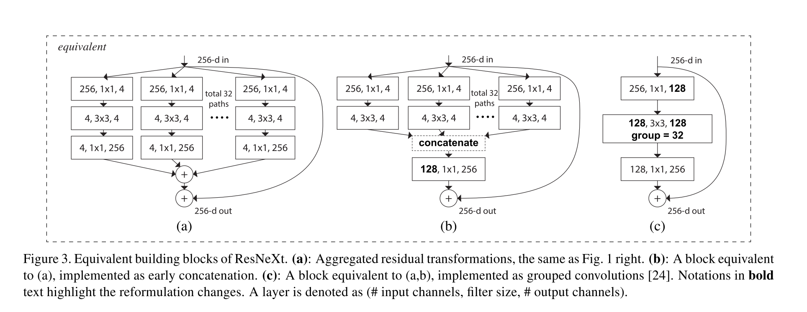

# [Aggregated Residual Transformations for Deep Neural Networks](https://arxiv.org/abs/1611.05431)

Tags: task.object_classification, task.object_detection  
Date: 11/16/2016  

- The authors are motivated to design a simple network that results from repeating a simple building block, and at the same time explore a new dimension that affects model performance, namely "cardinality"
    - They are also motivated to combine some of the benefits of the VGG architecture (namely the simplicity of stacking building blocks of the same shape) and the family of Inception architectures (which show improved performance as a result of a *split-transform-merge* strategy)
- The authors propose a network (ResNeXt) that is built using residual-like building blocks that aggregate a set of transformations with the same topology
    - They formulate their block as a set of *aggregated* transformations, and argue that the dimension of these aggregated transformations (the cardinality) controls the number of more complex transformations that the network can learn (whereas width controls the number of simple transformations)
    - The block consists of two main components:
        - A residual connection that allows the raw-input to the block to be added back to the features generated within the block
        - A set of transformations that are applied to the raw input, where the size of the set of transformations is what the authors refer to as "cardinality"
            - This set of transformations can be viewed as a group convolution, which is how the authors implement it
- They test their proposed network on object classification using ImageNet-[1k | 5k], CIFAR-[10 | 100], and object detection using MS COCO
    - They earn second place on ImageNet-1k with their entry
    - When comparing ResNet to ResNeXt models on Imagenet-5k, they see large improvements in performance with the ResNeXt models
    - They set SOTA on CIFAR-[10 | 100]
    - On MS COCO object detection, ResNeXt shows improved performance compared to ResNet models
- Through training / experimentation, they note:
    - In comparing ResNet-[50 | 101] to ResNext-[50 | 101] (using 32 x 4d) on ImageNet-1k, they see improved performance with ResNext. This improvement is not only a decreased validation error, but a much lower training error as well, suggesting that the gains are *not* from regularization but from *stronger representations*
    - With complexity preserved, increasing cardinality from 1 to 32 and decreasing width continues to decrease the error rate, but starts to saturate in performance when the bottleneck width is small
    - Increasing cardinality provides larger improvements than increasing depth or width, at least when looking at ResNet-101 and wider ResNet-101
    - When removing residual connections from both ResNet and ResNeXt models, the ResNet models show a much larger drop in performance relative to ResNeXt models, which suggests that the residual connections are helpful for *optimization*, whereas the aggregated transformations are stronger *representations*

## ResNeXt module

