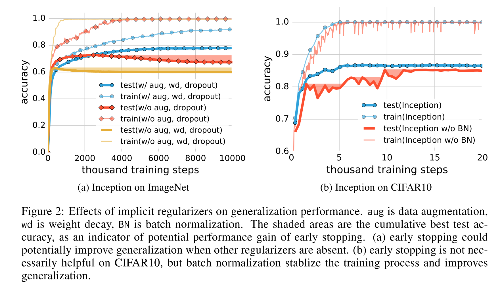

# [Understanding deep learning requires rethinking generalization](https://arxiv.org/abs/1611.03530)

Date: 11/10/2016  
Tags: topic.generalization

- The authors are motivated to study why large neural networks generalize in practice
    - Traditional views of generalization have proposed a number of different complexity measures that are capable of controlling generalization error, namely the Vapnik–Chervonenkis dimension (or VC dimension), the Rademacher complexity, and uniform stability
- The authors run a number of experiments that are variants of randomization tests from non-parametric statistics, and in each case the networks are able to overfit the training data and demonstrate reasonable generalization. Furthermore, they had to change very little (if anything) about the training procedure (learning rate, number of epochs, etc.) for the models to overfit.
    1. Partially corrupted labels - independently with probability p, the label of each image is corrupted as a uniform random class
    2. Random labels - all the labels are replaced with random ones
    3. Shuffled pixels - a random permutation of the pixels is chosen and then the same permutation is applied to all the images in both the training and test sets
    4. Random pixels - a different random permutation is applied to each image independently
    5. Gaussian - A Gaussian distribution (with matching mean and variance to the original image dataset) is used to generate random pixels for each image
- The authors also run a number of experiments with various forms of explicit regularization (data augmentation, weight decay, and dropout) as well as implicit regularization (early stopping) turned on / off
    - Even with all regularizers turned off, all of the models still generalize very well
- Through training / experimentation, they note:
    - Because deep neural networks can easily fit random labels, the effective capcity of neural networks is sufficient for memorizing the entire data set
    - Explicit regularization may improve the generalization performance, but is neither necessary nor by itself sufficient for controlling generalization error
    - For linear models, SGD always converges to a solution with small norm, and hence is implicitly regularizing the solution
    - Traditional views of generalization fail to explain why large neural networks generalize in practice
        - Uniform stability is independent of the labeling of the training data, and hence is not strong enough to distinguish between the models trained on the true labels and those trained on random labels
    - Regularizers, when properly tuned, could help to improve the generalization performance. But, it is unlikely that they are the fundamental reason for generalization, since networks continue to perform well even after regularizers are removed.

## Training Curves

