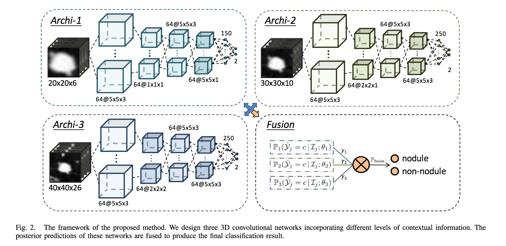

# [Multi-level Contextual 3D CNNs for False Positive Reduction in Pulmonary Nodule Detection](https://www.researchgate.net/profile/Qi_Dou2/publication/308665472_Multi-level_Contextual_3D_CNNs_for_False_Positive_Reduction_in_Pulmonary_Nodule_Detection/links/5a646171aca272a1581cf4ca/Multi-level-Contextual-3D-CNNs-for-False-Positive-Reduction-in-Pulmonary-Nodule-Detection.pdf)

Date: 09/01/2016  
Tags: task.object_classification, domain.medical

- The authors are motivated to develop a network that classifies lung nodule candidates as true nodules or false positives
- They propose a simple strategy to encode multi-level contextual information to combat the wide variability of the nodule candidates, wherein they build three 3D convolutional neural networks to classify the nodule candidates
    - Each of the three convolutional neural networks receives the same candidate, but receives the image patch surrounding the candidate at a different resolution (e.g. 20x20x6, 40x40x26, and 30x30x10). They found that the three resolution sizes they use cover 99% of the nodules in the dataset.
    - The 3D networks are fairly simple, and contain ~4-5 convolutional layers followed by max pooling, ending with a fully connected output layer. At test time, the softmax outputs of the three models are combined via a weighted average.
- They test their method in the false positive reduction track of the LUNA challenge, and obtain (at the time of submission) the best score of 0.827

## Mutli-Level Contextual 3D CNNs

