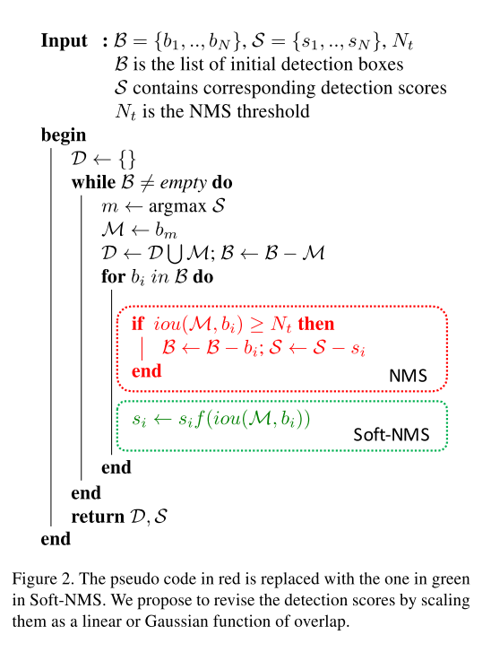
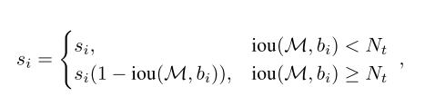
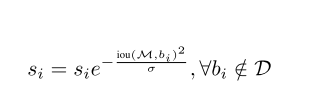
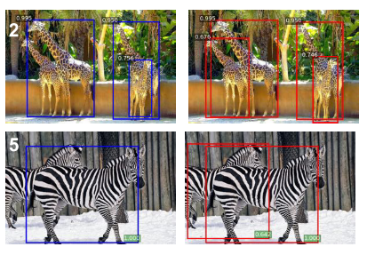

# [Soft-NMS -- Improving Object Detection With One Line of Code](https://arxiv.org/abs/1704.04503)

Date: 4/14/2017  
Tags: task.object_detection, topic.post_processing

- The author are motivated to improve upon the traditional non-maximum suppression algorithm used in object detection, which can lead to misses for highly overlapping objects.
    - Non-maximum suppression (NMS) significantly reduces the number of false positives, but a major drawback is that it sets the score for neighboring detections to zero. Therefore, if an object is actually present in the overlap threshold used in the non-maximum suppression, it would be missed because its score would be set to zero.
    - For general object detection, different NMS thresholds may be suitable for different applications, which means that there is not a single NMS threshold that would work for all applications, despite having to pick one when using NMS.
- The authors propose soft non-maximum suppression, which decays the detection scores of all other objects as a continuous function of their overlap with a detection box
    - They propose to decay the scores either (a) as a linear function of the overlap or (b) as a Gaussian function of the overlap. The linear function has the drawback that a sudden penalty is applied when the NMS threshold is reached.
- The authors test their method across multiple networks (SDD, YOLO, R-FCN, and Faster-RCNN) and multiple datasets (MS-COCO and PASCAL VOC 2007)
    - For MS-COCO, soft-NMS provides an improvement of 1.3% and 1.1% respectively for R-FCN and Faster-RCNN
    - For PASCAL VOC 2007, soft-NMS provides an improvement of 1.7% for both R-FCN and Faster-RCNN
- Through training / experimentation, the authors note:
    - For R-FCN, soft-NMS improves maximum performance for animals which are found in a heard (e.g. zebra, giraffe, sheep. etc.) by 3-6%, while there is little gain for objects like toaster, sports ball, hair drier, etc.
    - Using the Gaussian decay function works just as well, if not better, than using the linear scale decay function
    - Across all parameter settings, the best sigma parameter (for the Gaussian decay function) performs better than a hard threshold selected in traditional NMS
    - At higher values of recall and overlap threshold, soft-NMS obtains significant gains in precision over traditional NMS
    - Soft-NMS helps in cases when bad detections (false positives) have a small overlap with a good detection (true positive) and also when they have a low overlap with a good detection

## Soft-NMS Algorithm

## Linear (top) versus Gaussian (bottom) decay

## Traditional NMS (left) versus Soft-NMS (right)

