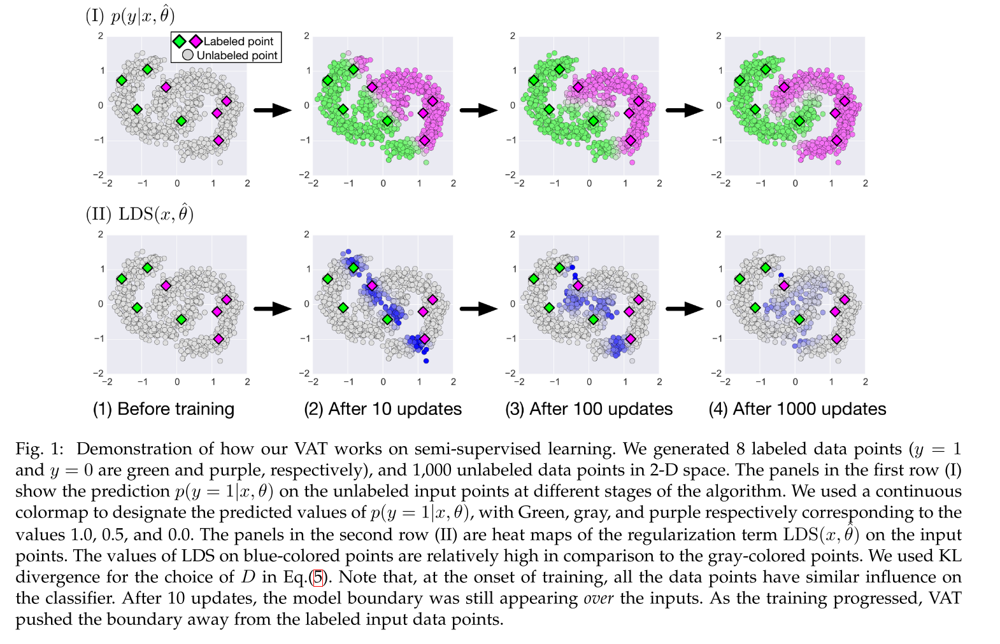

# [Virtual Adversarial Training: A Regularization Method for Supervised and Semi-Supervised Learning](https://arxiv.org/abs/1704.03976)

Tags: task.object_classification, topic.semi-supervised_learning  
Date: 04/13/2017

- The authors are motivated to develop a novel regularization method that identifies which direction a classifier's behavior is most sensitive in, and then trains the *output distribution* to be isotropically smooth around each input data point
    - Their method has a number of advantages relative to other forms of regularization:
        - It's applicable to semi-supervised learning tasks
        - It can be applied to any parametric model for which we can evaluate the gradient with respect to the inputs and parameters
        - There are only a small number of additional hyperparameters introduced with their approach (only two - epsilon and alpha)
        - Their method is a parametrization invariant form of regularization, in contrast to something like L_p normalization that is dependent on the current parameter-setting
- The authors propose a method in which they selectively smooth the model in its most anisotropic distribution by regularizing the model using the virtual adversarial direction
    - The virtual adversarial direction is the direction of the perturbation that can most greatly alter the output distribution in the sense of distributional divergence
        - This is similar but different from the adversarial direction introduced by Goodfellow when discussing adversarial examples - Goodfellow's adversarial direction refers to the direction that can most greatly "deviate" the prediction of a model from the correct label.
        - Since their definition of virtual adversarial direction relies on distributional divergence, it does not require labels and can be used in semi-supervised training
    - The regularization term they introduce is the average of local distributional smoothness (LDS) over all input data points
        - Local distributional smoothness (LDS) is the divergence-based distributional robustness of the model against the virtual adversarial direction
    - To ensure efficient training, they also propose an efficient manner in which to calculate the virtual adversarial direction (the standard way is fairly computationally intensive, and would be time prohibitive during training)
        - Their method makes use of the power iteration method as well as the finite difference method
- They test the proposed method on MNIST, CIFAR-10, and Street View House Numbers (SVHN)
    - On MNIST, they perform competitively to other semi-supervised methods, but there are a good number of methods that perform better when using only a fraction of the labeled instances
    - On CIFAR-10 and SVHN, they outperform all existing methods both with and without data augmentation when using only a fraction of the labeled instances
- Through training / experimentation, they note:
    - In experiments on MNIST, tuning epsilon alone was sufficient for achieving satisfactory performance (i.e. not tuning alpha). The algorithm performed best when alpha was set to 1 across multiple different epsilon levels, and so the authors just left alpha set to 1 and worked on tuning epsilon.
    - There is a significant difference between 0 and 1 iterations when performing the power iterations, but past 1 the results are not much different (as measured by the value of the regularization term)
    - Small values of epsilon lead to virtual adversarial examples that are difficult for human eyes to distinguish from the clean images, while larger values of epsilon can lead to adversarial examples that are on the verge of total corruption
    - On adversarial examples that are gathered when training with high values of epsilon (where the examples are on the verge of total corruption and the model should make almost no mistakes), the model trained with virtual adversarial training (VAT) has a much lower rate of misidentification than the model trained without VAT
    - A model trained with VAT does much better at identifying its own adversarial examples as well as the ones generated using the model trained without VAT, whereas the model trained without VAT does not do well at identifying adversarial examples generated using the model trained with VAT

## Virtual Adversarial Training Example

## Local Distributional Smoothing Term

## Regularization Term

