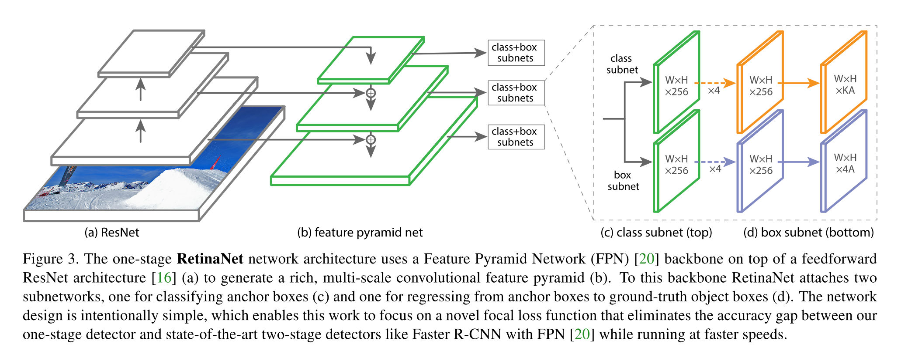
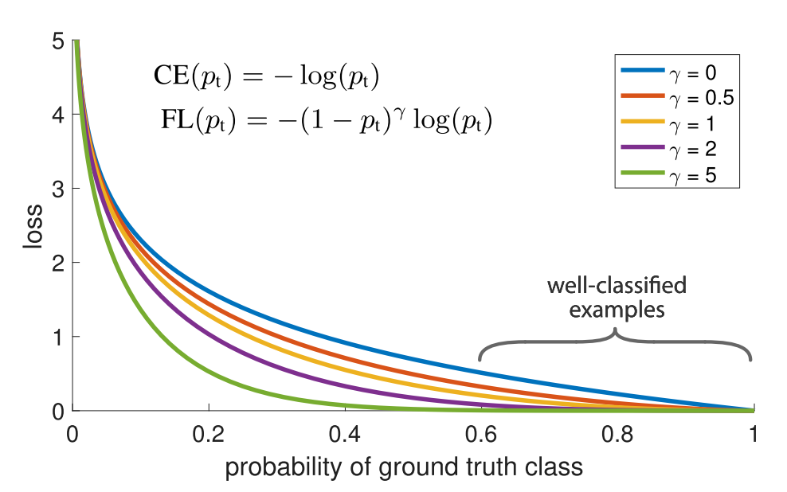
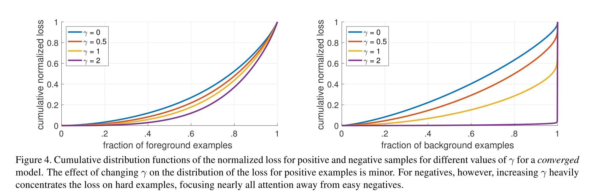

# [Focal Loss for Dense Object Detection](https://arxiv.org/abs/1708.02002)

Date: 08/08/2017  
Tags: task.object_detection, topic.loss_functions

- The authors are motivated to improve object detection performance by addressing the extreme foreground-background class imbalance encountered during training of dense detectors
- The authors propose a novel loss function (focal loss) by reshaping the standard cross entropy loss such that it down-weights the loss assigned to well-classified examples.
    - The loss focuses training on a sparse set of hard examples, and takes the following form, where the novel (1 - p_t)^gamma term is a modulating factor with the tunable focusing parameter gamma:

    
- They test their proposed method against a baseline of using weighted binary cross entropy loss, and train using a network they title RetinaNet
    - RetinaNet consists of a *backbone* (a feature pyramid network based on ResNet) and two task-specific *subnetworks* - the *backbone* is responsible for computing a convolutional feature map over the entire image and the subnetworks are responsible for performing object classification and bounding box regression
    - They use anchor boxes similar to those used in the region proposal network of Faster R-CNN, but adjust the assignment rule a bit. Anchors are assigned to ground-truth object boxes using an IoU threshold of 0.5, and to background if their IoU is < 0.4.
    - The total focal loss of an image is computed as the sum of the focal loss over all anchors, *normalized* by the number of anchors assigned to a ground-truth box
    - Their proposed method is tested on the COCO object detection task, where the achieve SOTA while running at faster speeds than two-stage detectors (e.g. Faster R-CNN with FPN)
- Through experiments, they note:
    - They initialize the bias in the final convolutional layer of the classification subnet to the probability of getting the rare class (i.e. % of foreground examples) to improve training stability in the case of heavy class imbalance. They found that when training using *standard cross entropy*, the network would not converge without setting this bias. This effectively means that at the start of training every anchor is labeled as foreground with confidence of that probability value (which is 0.01 in the paper).
    - Lower alphas (the class balancing weight) are selected for higher gammas (the focusing parameter) in the focal loss
    - As gamma increases, the cumulative distribution function of the normalized loss doesn't change too much for positive examples, but changes quite a bit for negative examples. And, it changes in a way that the loss is heavily concentrated on hard examples.
    - Focal loss is more effective than online hard example mining, as well as using a hinge loss (using hinge loss was actually unstable)
    - They found that using 6-9 anchors per spatial position in each pyramid level performed best (they searched over 1-12 anchors)

## RetinaNet architecture

## Focal Loss

## Distribution of loss for positive / negative examples

