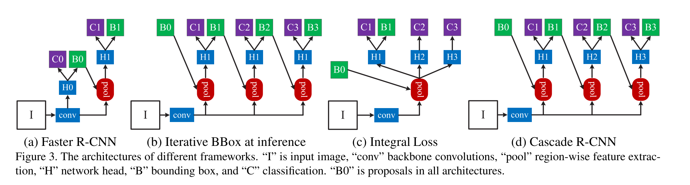

# [Cascade R-CNN: Delving into High Quality Object Detection](https://arxiv.org/abs/1712.00726)

Tags: task.object_detection  
Date: 12/03/2017  

- The authors are motivated to develop a multi-stage object detection architecture to allow for high quality detections across a variety of IoU thresholds, aiming to solve several problems with existing architectures:
    - Object detectors trained with low IoU thresholds (as is commonly done) tend to produce noisy detections
    - Object detectors trained with increasing IoU thresholds tend to show degraded performance, due to:
        - Overfitting during training, which occurs because of exponentially vanishing positive samples (as you increase the IoU threshold)
        - Inference-time mismatch between the IoUs for which the detector is optimal and those of the input hypotheses
- The authors propose a multi-stage object detection architecture that consists of a sequence of detectors trained with increasing IoU thresholds, where each detector is sequentially more selective against close false positives
    - Each detector in the sequence is trained using the output of the previous detector in the sequence (where the first is trained using proposals from a region proposal network)
    - Each detector in the sequence is trained to be more selective against false positives by being trained using a higher IoU threshold
- The authors test their proposed method on MS-COCO
    - Their model outperformed all *single-model* detectors by a large margin, under all evaluation metrics
- Through training / experimentation, they note:
    - Bounding box regressors trained at different IoU thresholds perform best for examples of IoU close to the threshold the detector was trained on, e.g. a detector trained with IoU threshold 0.5 outperforms a detector trained with an IoU threshold of 0.6 for low IoU examples
    - Regressors trained with a given IoU threshold tend to produce bounding boxes of higher IoU (i.e. the regression is successfully generating more accurate boxes)
    - Adding additional stages in the sequence improves detection performance, but levels off at 4 stages
    - When implementing their framework with other detection networks, it improves on those baselines by 2-4 points in terms of average precision

## Cascade R-CNN

