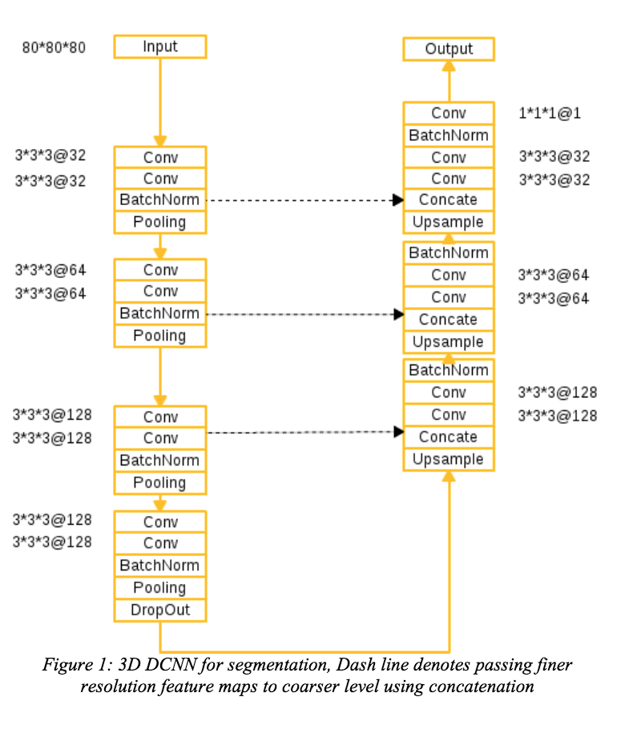
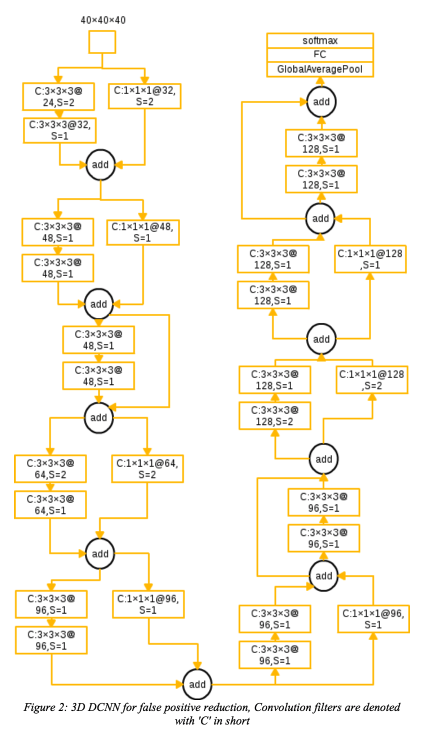

# [Deep Convolution Neural Networks for Pulmonary Nodule Detection in CT imaging](http://luna16.grand-challenge.org/serve/public_html/pdfs/20171222_073722_JianpeiCAD_NDET.pdf/)

Date: 12/22/2017  
Tags: task.object_detection, task.object_classification, domain.medical

- The authors are motivated to develop a state-of-the-art nodule detection system
- They propose a framework with two stages:
    - Nodule Candidate Detection Networks: They use a 3D as well as a 2D U-Net style network to predict segmentation masks. 
        - For the 3D netowrk they use sliding windows (patches) of 128x128x128, and for the 2D they use sliding windows (patches) of 128x128.
        - To combine the probability maps from the two, they threshold them both and then merge by keeping non-overlapping regions between the two and using the intersection of any regions that are overlapping
    - False Positive Reduction Network: They use a 3D ResNet based architecture to classify nodule candidates from the first stage as true nodules or false positives.
- They test their method using the LUNA challenge data, and obtain an average FROC of 0.95 (2nd place at the time of writing)
    - At test time, they use data augmentation and average the probability outputs of the augmented patches

## Nodule Candidate Detection Network

## False Positive Reduction Network

