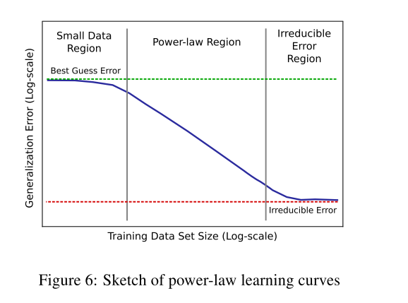

# [Deep Learning Scaling is Predictable, Empirically](https://arxiv.org/abs/1712.00409)

Date: 12/01/2017  
Tags: task.language_modeling, task.object_classification, task.speech_recognition, topic.scalability  

- The authors are motivated to empirically study generalization error and model size growth as training sets grow
    - In particular, they are interested in estimating the costs, in both data and compute requirements, for advancing state-of-the-art
- To estimate learning curves and model size scaling trends, the general process is to select state-of-the-art models and to train "hyperparameter-reduced" versions of these models on successively larger subsets of a training set to see how the accuracy of the model grows with training set size
    - They work with "large" datasets, which they classify to be a training set that could be reduced in size by 2-3 orders of magnitude and still be significant enough to perform valuable model architecture studies
        - When training on successively larger subsets of the training set, they divide their training sets into subsets that span 2-3 orders of magnitude in steps of roughly 2x
    - To find the models they use for the "training procedure":
        1. They replicate the state-of-the-art results on the entire training set, setting hyperparameters of the model as described in the literature
        2. They find the smallest model size that is able to overfit each subset of the training set.
    - With the best-fit models defined for the smallest and largest subsets of the training set, they perform a stochastic Monte Carlo grid search to find the best-fit hyperparameter-reduced models for each subset of the training set
        - To approximate the generalization error expectation calculations without an excessive number of training runs, they select models using the median minimum validation error across multiple training runs with separate random seeds
- They estimate learning curves across four domains:
    1. Neural machine translation using a state-of-the-art sequence-to-sequence model with global attention, on an open source German-to-English data set.
    2. Word and character level language models using LSTM-based models that were early state-of-the-art models in 2016.
    3. Image classification using Residual Networks on the ImageNet dataset.
    4. Speech recognition using a Deep Speech 2 implementation as well as an attention-based-model.
- Through training / experimentation, they note:
    - The majority of theoretical work predicts that error learning curves take a power-law form with exponents of either -0.5 or -1, while their experiments show exponents between -0.07 and -0.35
    - Learning curves for a single model family can be closely represented by a power law + constant, where the constant is the error when the model family has exhausted its capacity (this was when modeling neural machine translation)
    - Model size results show that best-fit models grow sublinearly in size relative the training subset size (this was when performing word level language modeling)
    - The power law constants for a set of learning curves are roughly the same despite the use of different optimizers; the curves are just shifted down or up depending on the optimizer (this was when performing character level language modeling)
    - Accuracy (for image classification) plateaus near random guessing on very small training sets
    - Model error is bounded between random guessing (on the higher end) and Bayes / irreducible error (on the lower end)
    - To beat the power-law as we increase data set size, models would need to learn more concepts with successively less data, i.e. models must successively extract more marginal information from each additional training sample
    - To improve error beyond the Bayes / irreducible error rate may require techniques that could increase the information content of the data to distinguish between samples that contribute to the Bayes error

## Power Law Learning Curves

