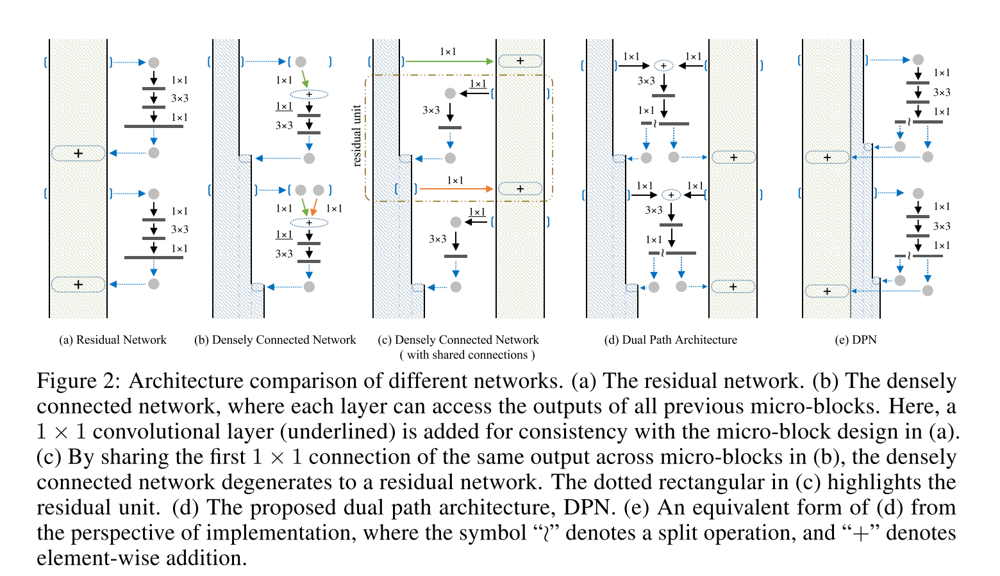

# [Dual Path Networks](https://arxiv.org/abs/1707.01629v2)

Tags: task.object_classification, task.object_detection, task.scene_classification, task.semantic_segmentation  
Date: 07/06/2017

- The authors are motivate to develop a network with a new topology of internal connections, one with dual paths that realizes the benefits of ResNet as well as DenseNet
    - ResNet enables feature re-usage while DenseNet enables new feature exploration, which are both important for learning good representations
- The authors propose a dual path architecture that shares features across all blocks to enjoy the benefits of reusing common features with low redundancy (i.e. the benefits of ResNet) while still having a densely connected path to give the network more flexibility in learning new features (i.e. the benefits of DenseNet)
    - The architecture effectively consists of micro-blocks that are designed in a bottleneck style, with the output of the micro-block being split into two parts: the first part is element-wisely added to the residual path stream, and the second part is concatenated with the densely connected stream
- They test their method on image classification using ImageNet-1k, scene classification using Places365, object detection using PASCAL VOC, and semantic segmentation using PASCAL VOC
    - They achieve SOA on ImageNet, with training times that are faster than many competitive networks, as well as fewer parameters / computational requirements compared to other competitive networks
    - On Places365, they achieve better validation accuracy (no mention of test accuracy), again with fewer parameters than most other competitive networks (InceptionNet was 1/3 the model size of the DPN)
    - On PASCAL VOC object detection, they outperform ResNet and ResNeXt networks
    - On PASCAL VOC semantic segmentation, they outperform ResNet and ResNeXt networks
- Through training / experimentation, they note:
    - Their dual path architecture requires fewer parameters compared to ResNext (15% fewer comparing DPN-92 to ResNeXt-101 (32 x 4d) and 26% fewer comparing DPN-98 to ResNeXt-101 (64 x 4d))
    - Their dual path architecture requires fewer FLOPs compared to ResNext (19% fewer comparing DPN-92 to ResNeXt-101 (32 x 4d) and 25% fewer comparing DPN-98 to ResNeXt-101 (64 x 4d))
    - Their dual path network (DPN) is capable of learning robust features for object detection as well as semantic segmentation
    - Dense networks can be viewed as a specific form of a Higher Order RNN (HORNN), and residual networks can be viewed as a special case of densely connected networks

## Dual Path Architecture

