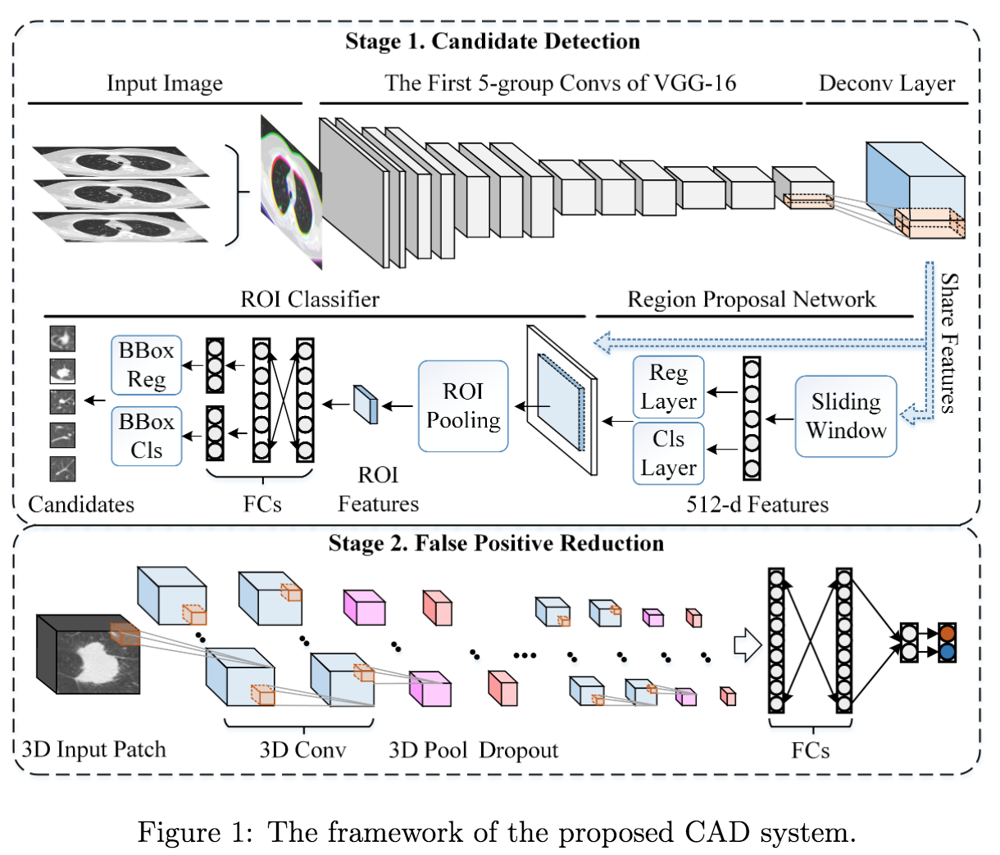

# [Accurate Pulmonary Nodule Detection in Computed Tomography Images Using Deep Convolutional Neural Networks](https://arxiv.org/abs/1706.04303)

Date: 06/14/2017  
Tags: task.object_detection, task.object_classification, domain.medical

- The authors are motivated to develop a detection algorithm for lung nodules
- The authors propose a nodule detection approach that consists of two stages:
    1. Nodule Candidate Detection: They use a network based on Faster R-CNN, but adjust the regional proposal network by adding a deconvolutional layer to allow for higher performance on detecting small objects (i.e. nodules).
        - This network takes as input an image and outputs a set of rectangular object proposals (i.e. ROIs).
        - They use the first 5-group convs of VGG-16 as the base (before adding the deconv layer)
        - It's not explicit, but it sounds like they train this network end-to-end by mergining the region proposal network loss and final output bounding box losses (i.e. from the ROI classification network), as opposed to in stages as in the original Faster R-CNN paper.
        - As in the original Faster R-CNN paper, the regional proposal network and ROI classification network share the same feature extraction layers
    2. False Positive Reduction: They use a 3D convolutional network to classify whether the nodule candidates from the first stage are true nodules or false positives. This network is one with several convolutional blocks followed by a pooling operation (and dropout), and a fully connected layer as the output layer (fed into a softmax).
        - This network takes in a 3D patch surrounding the nodule candidate of interest
        - To balance the number of positive and negative patches in the training set, they duplicate the positive patches by 8 times
- The authors test their proposed method on the LUNA nodule detection challenge, and achieve first place (at the time of writing) for the nodule detection track with an average FROC of 0.891
    - The authors also achieve (at the time of writing) the highest sensitivity for the task of candidate detection at the lowest # of candidates / scan (0.946 sensitivity at 15.0 candidates / scan)
- Through experimentation and comparison to a couple of base models, the authors note:
    - Adding in the deconvolution layer improved sensitivity by ~15.8% (relative) while at the same time decreasing the number of candidates / scan to get that improved sensitivity
    - Using 6 anchors per sliding window instead of 4 (as in the Faster R-CNN paper) improved sensitivity by ~5.7% (relative) while at the same time decreasing the number of candidates / scan to get that improved sensitivity

## Nodule Detection and False Positive Reduction Networks

