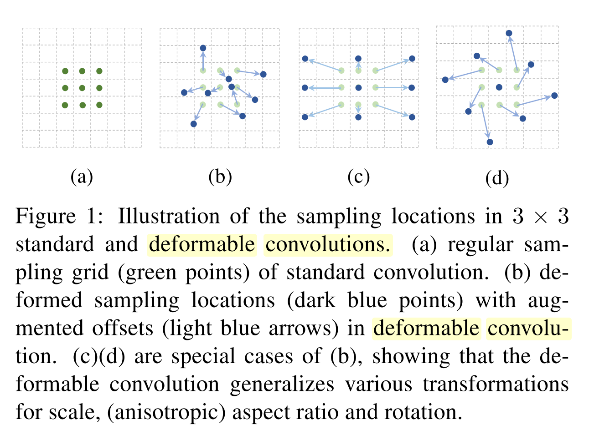
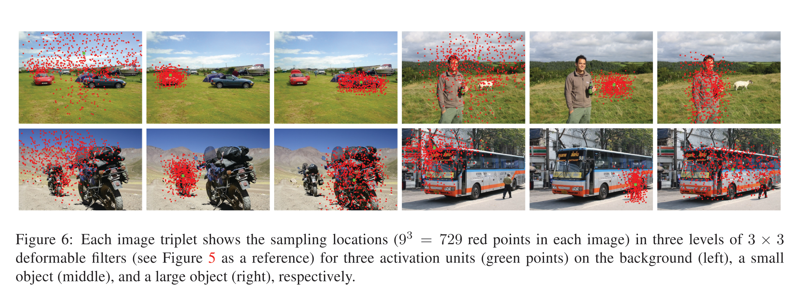
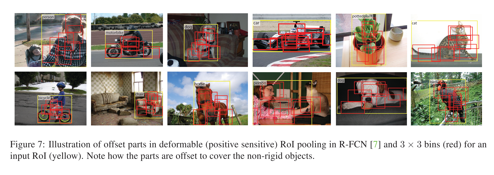

# [Deformable Convolutional Networks](https://arxiv.org/abs/1703.06211)

Date: 03/17/2017  
Tags: task.object_detection, task.semantic_segmentation

- The authors are motivated to develop new modules to enhance the transformation modeling capability of CNNs
    - One of the key challenges in visual recognition is how to accommodate geometric variations or model geometric transformations in object scale, pose, viewpoint, and part deformation. CNNs are inherently limited in their modeling of large, unknown transformations.
    - Since different locations in an image may correspond to objects with different scales or deformations, adaptive determination of scales or receptive field sizes is desirable for visual recognition with fine localization (e.g. semantic segmentation using fully convolutional networks)
- The authors propose two new modules to greatly enhance CNNs capability of modeling geometric transformations:
    - The two new modules are:
        - Deformable convolution, which adds 2D offsets to the regular grid sampiling locations in the standard convolution. This enables free form deformation of the sampling grid.
        - Deformable RoI pooling, which adds an offset to each bin position in the regular bin position of the previous RoI pooling.
    - Both modules are fairly lightweight, and the offsets in each of them are able to be learned.
- They test their methods on semantic segmentation as well as object detection tasks.
    - For semantic segmentation, they use the PASCAL VOC and CityScapes datasets
    - For object detection, they use the PASCAL VOC and COCO datasets
- Through training / experimentation, they note:
    - Using increasing numbers of deformable convolutional layers with ResNet-101 as a feature extraction network shows increasing accuracy, but starts to saturate after using 3 deformable convolutional layers.
    - The learned offsets in the deformable convolutional layers are highly adaptive to the image content
        - The receptive field sizes of deformable filters are correlated with object sizes, indicating that the deformation is effectively learned from image content
        - The filter sizes on the background region are between those on medium and large objects, indicating that a relatively large receptive field is necessary for recognizing the background regions
    - Adding deformable RoI pooling to Faster R-CNN and R-FCN produces noticeable improvements in performance, and has additive gains to adding in deformable convolutional layers.

## Deformable Convolutions

## Deformable Convolution Filter Sampling Locations

## Deformable RoI Pooling Offset Parts

