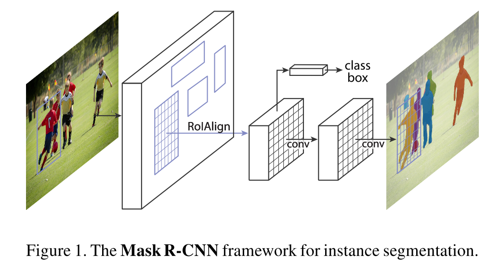

# [Mask R-CNN](https://arxiv.org/abs/1703.06870)

Date: 03/20/2017  
Tags: task.object_detection, task.instance_segmentation, task.keypoint_detection

- The authors are motivated to develop a conceptually intuitive, flexible, and robust framework for instance segmentation (similar to what Fast / Faster R-CNN and FCN offer for object detection and semantic segmentation)
- They propose an extension to Faster R-CNN wherein they add a branch for predicting segmentation masks for each Region of Interest, where the mask branch is a small FCN applied to each RoI
    - They address the loss of spatial information in the RoIPool layer by proposing a RoIAlign layer, which simply avoids the quantization that occurs in the RoIPool layer (and uses bi-linear interpolation), which allows for proper alignment of the extract features with the input.
    - At the end of the mask branch, a per-pixel sigmoid is applied, and the mask loss is defined as the average binary cross-entropy loss applied *only for the mask associated with the ground truth class*
    - To adjust this branch for keypoint detection, they simply encode the K keypoints of an instance as a one-hot binary mask where only a single pixel is labeled as foreground
- They tested their proposed method on COCO (instance segmentation, object detection, and keypoint detection), as well as CityScapes (instance segmentation)
    - On each task of COCO, they set a new SOTA
    - On CityScapes, they also set SOTA
- Through ablation experiments, they find: 
    - Using deeper networks for the feature extraction backbone yields better results (e.g. using ResNet 50 versus ResNet 101, or advanced designs such as Feature Pyramid Networks or ResNeXt))
    - Decoupling the class and mask prediction (i.e. using a sigmoid instead of a softmax) in the mask branch improves performance (~25% relative improvement in AP)
    - Using the RoIAlign layer instead of RoIPool also improves results (up to ~50% relative improvement in AP for instance segmentation, and ~7% relative improvement for keypoint detection)
    - Using FCNs for the mask branch (compared to MLPs) improves performance

## Mask R-CNN

