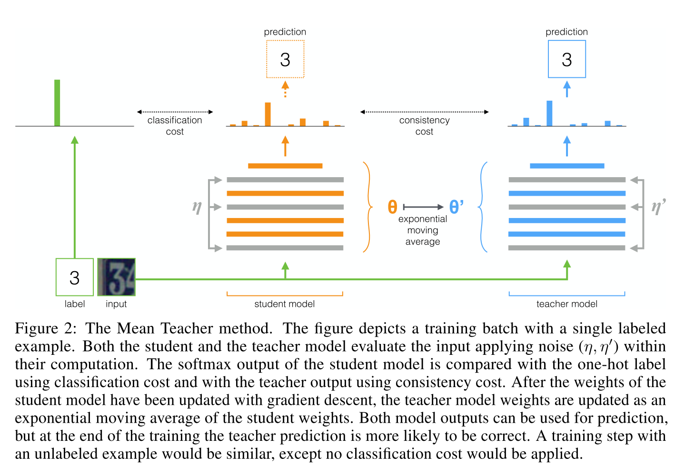

# [Mean teachers are better role models: Weight-averaged consistency targets improve semi-supervised deep learning results](https://arxiv.org/abs/1703.01780)  

Tags: task.object_classification, topic.semi-supervised_learning   
Date: 03/06/2017

- The authors are motivated to overcome some of the shortcomings of Temporal Ensembling and develop a semi-supervised method that is able to be used when learning large datasets
    - With Temporal Ensembling, the targets change only once per epoch, which makes Temporal Ensembling unwieldy when learning large datasets. It also makes it difficult to use in an online fashion.
- The authors propose Mean Teacher, a method that averages model weights instead of label predictions (which is what Temporal Ensembling does)
    - Viewing their approach in the framework of a student-teacher type model, they are aiming to develop a much better teacher model
    - The authors average the model weights over training steps (using an exponential moving average) to develop the teacher (which is why it's called Mean Teacher)
        - Averaging over each individual training step ensures that the teacher model can aggregate information after every step, and not every epoch (as is the case with the Temporal Ensembling approach), which has two practical advantages over Temporal Ensembling:
            - More accurate target labels lead to a faster feedback loop between the student and teacher models, resulting in better accuracy (target labels are in theory more accurate because the teacher model is updated more frequently)
            - Their approach scales to large datasets and online learning
    - Their loss function involves two components:
        - A classification loss that is applied to the output of the network when there is a label present
        - A consistency loss (mean-squared error) that is applied between the student and teacher predictions.
    - During training, both the consistency cost as well as the learning rate were ramped up from 0 to their maximum values over time using a sigmoid-shaped function
- They test their method on CIFAR-10, Street View House Numbers (SVHN), and ImageNet
    - On CIFAR-10 and Street View House Numbers, Mean Teacher improves results over the baseline methods, but doesn't work as well as a recently published Virtual Adversarial Training method
    - On ImageNet, they saw a clear improvement over SOTA
- Through training / experimentation, they note:
    - In the all-labeled case, Mean Teacher performs very similarly to other methods
    - Noise (either input augmentation or dropout) is still necessary to obtain passable performance with Mean Teacher. It's not the case that you can drop it when using Mean Teacher and still expect good results.
    - The essential hyperparameters for mean teacher, the consistency cost weight and the exponential moving average decay, span roughly an order of magnitude in terms of their "good" values, but performance quickly degrades outside of this range
    - The coupling of the classification loss and consistency loss is beneficial, and without this coupling the model performance drops noticeably

## The Mean Teacher Method

