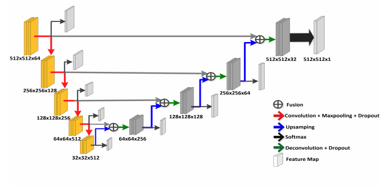
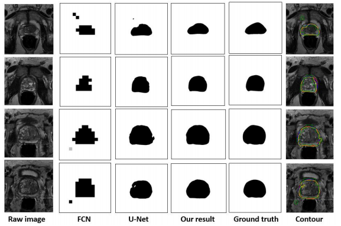

# [Deeply-Supervised CNN for Prostate Segmentation](https://arxiv.org/abs/1703.07523)

Tags: task.semantic_segmentation, domain.medical, topic.deep_supervision

- Motivated to try to tackle the lack of clear boundary for prostate segmentation (specifically at apex and base), as well as the huge amount of variation in shape and texture between images from different patients
    - They believe that deep supervision should help to more effectively capture the boundaries of the parts of the region that should be segmented
- They use 2D UNet as a baseline, and add in deep supervision to that
    - They add deep supervision to each level of resolution (i.e. after each downsampling and upsampling block), but leave out details as to how they get the downsampled output back to the original resolution that matches with the final layer output
    - The deeply supervised components of the loss have some weighting to them, but they don't give detail as to how they are originally weighted or how the weights change throughout the process of training (or if they do at all)
    - They used dice loss for their objective
- They tested on a dataset of prostate segmentations, and found a ~2.5% improvement on the mean dice, and a 0.5% improvement on the median dice

## Segmentation with Deep Supervision

## Segmentation Results

