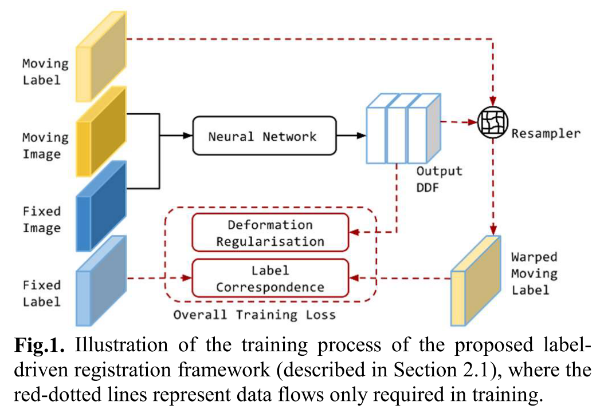
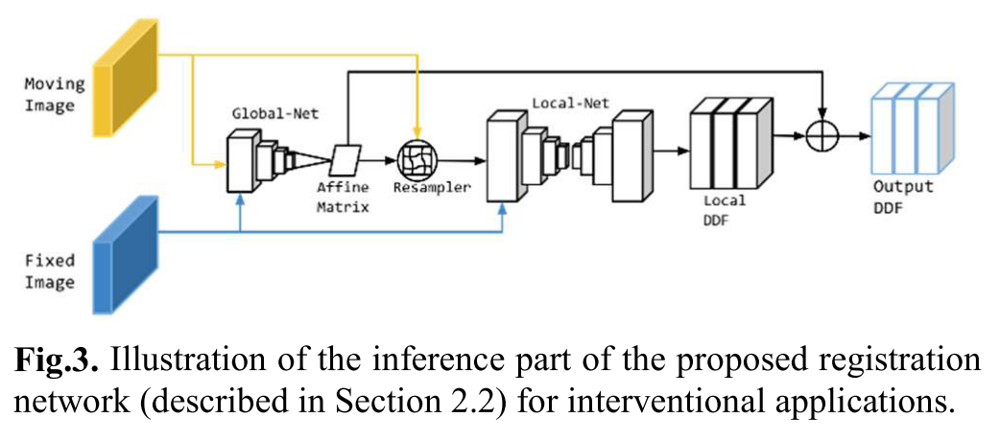

# [Label-driven weakly-supervised learning for multimodal deformable image registration](https://arxiv.org/abs/1711.01666)

Date: 11/05/2017  
Tags: task.image_registration, domain.medical, topic.weak_supervision

- The authors are motivated to build a fast and robust algorithm for spatially aligning (i.e. registering) medical images from different modalities
    - Problems with other methods include:
        - Lack of a robust image similarity measure: Classical methods use intensity based image similarity measures, which can be problematic when two different structures are registered just because of strong statistical correlation between their pixel intensities
        - Reliance on sparse image features (e.g. prostate capsule surface), which can be time-consuming to collect annotations for and / or have high variability
- They propose a novel weakly-supervised, label-driven formulation for learning 3D voxel correspondence from higher-level label correspondence
    - Their method consists of a couple of pieces: 
        1. For a pair of training images to align (i.e. a moving image aligned to a fixed image), a neural network computes a dense displacement field (DDF). This network consits of two parts, where the final dense displacement field is a combination of the diplacements output by each part. The two parts are:
            1. A "global-net" that takes in the concatenated pair of the fixed and moving image and predicts an affine transformation matrix (i.e. the 12 parameters that define a 3D affine transformation)
            2. A "local-net" that takes in the concatenated pair of the fixed and affine-transformed moving image, and generates a local dense displacement field
                - The output layer is a convolutional layer added to a bias term, without batch normalization or a non-linear activation, enabling random initialization with zero mean and a small variance.
        2. The dense displacement field is applied to a moving label, i.e. a label map for the moving image
        3. Cross-entropy loss is calculated on the warped moving label and the fixed label (i.e. label map for the fixed image)
        4. Depending on the availability of labeled data, smoothness of the dense displacement field is added to the overall loss, e.g. bending energy of the L2 norm
    - In their method, neither the fixed nor moving labels are used as inputs to the network, which means that they are not required at inference time (i.e. live registration)
    - To prevent under-fitting and under regularization due to the direct use of the binary maps, the authors propose a label smoothing mechanism that:
        - Provides a spatially smoothed probability map on the original background region while the original foreground region remains associated with one-hot probability vectors
        - Without affecting the one-hot probabilities of the foreground region, normalizes the sum of the probability map so that all labels in a given image are associated with the same weight
- The authors test the proposed method on 111 pairs of T2-weighted MR- and TRUS images from 76 patients
    - For labels, they collected full gland segmentations as well as landmark annotations, including the apex, base, urethra, visible lesions, junctions between the gland, vas deference and the seminal vesicles, and other patient specific landmarks (e.g. calcifications and / or cysts)
    - They achieve a median landmark centroid error of 4.2mm and a median dice of 0.88 on the prostate gland, compared to median errors of 9.4mm and 8.5mm and median dices of 0.73 and 0.86 for the global-net and local-net alone
- Through experimentation and training, they note: 
    - The "high confidence labels" (in their case, the whole gland segmentations) were sampled twice as frequently as others
    - The global-net and local-net were trained separately by minimizing the same loss function
    - With their method, more than 4 3D transformations can be performed per second on the same GPU

## Training Process / Architecture

## Inference Process / Architecture

