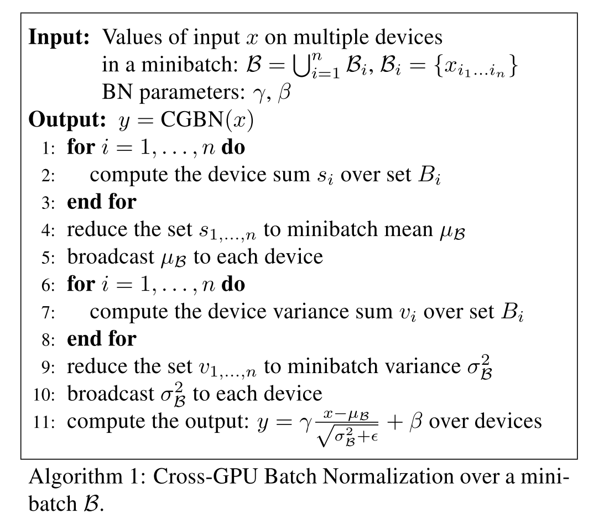

# [MegDet: A Large Mini-Batch Object Detector](https://arxiv.org/abs/1711.07240)

Tags: task.object_detection  
Date: 11/20/2017  

- The authors are motivated to study the effects of batch size on object detection networks, and train object detectors with a large mini-batch size (256) so that they can effectively utilize many GPUs (128) and significantly shorten the training time
    - Recent trends for image classification are to use very large mini-batch sizes to significantly speed up training, but the mini-batch sizes for object detection frameworks remain very small (e.g. 2-16) because of the large image sizes that are used in training
        - Small mini-batch sizes means lengthy training times, a failure to provide accurate statistics for batch normalization, and a larger likelihood that the number of positive and negative training examples within a batch are more likely imbalanced
- The authors propose training detection networks with large mini-batch sizes (using multiple GPUs) using Cross-GPU Batch Normalization (CGBN) in order to get better batch normalization statistics
    - To calculate BN statistics across GPUs on different machines, they apply *sub-linear* memory to save GPU memory consumption by slightly compromising the training speed
- They test the proposed method on object detection with MS COCO using a Feature Pyramid Network as the detection framework and they achieve SOTA
- Through training / experimentation, they note:
    - The assumption of gradient equivalence that leads to the linear scaling rule when training across multiple GPUs might be less likely to hold in object detection, and a variance equivalence assumption (which is weaker than the gradient equivalence assumption) makes more sense
    - When testing large mini-batch sizes (across multiple GPUs) with no batch normalization, many of the larger batch sizes show trouble converging, if they converge at all. They test across 16, 32, 64, and 128.
        - Batch size of 32 failed to converge on some training runs
        - For batch size 64, they had to half the learning rate to get any runs to converge, and the converged models showed noticeable accuracy loss
        - For batch size 128, no models converged, even if they halved the learning rate
    - When testing large mini-batch sizes (across multiple GPUs) with cross-gpu batch normalization, all training runs easily converged regardless of the mini-batch size. For these runs they also note:
        - Within the growth of mini-batch size, the accuracy almost remains the same level
        - When investigating longer training time policies, the longer training time slightly boosts the accuracy

## Cross-GPU Batch Normalization Algorithm

