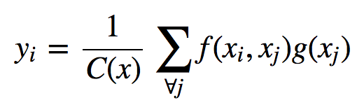
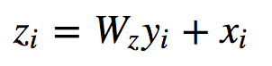

# [Non-local Neural Networks](https://arxiv.org/abs/1711.07971)

Tags: video_classification, object_detection, instance_segmentation, keypoint_detection, special_topics.non_local_neural_networks

- The authors are motivated to develop something that will better capture long-range dependencies than current methods (e.g. recurrent operations in LSTMs or convolutional + max pooling operations with a wide receptive field)
    - Recurrent and convolutional both process a local neighborhood, which means that long-range dependencies can only be captured when they are applied repeatedly. This is both computationally inefficient and can cause optimization difficulties.
- The authors propose generic non-local operations (a generalization of the classical non-local mean operation) as means for capturing long-range dependencies with deep neural networks
    - Non-local operations compute the response at a position as a weighted sum of the features at *all positions* in the input feature maps
    - Non-local operations offer several advantages:
        - They capture long-range dependencies directly by computing interactions between any two positions, regardless of their positional difference
        - They are efficient
        - They maintain the variable input sizes and can be easily combined with other operations
- The generic non-local operation is defined as:

    

  with the non-local block as:
  
    
  
  where *x_i* is a residual connection, which allows them to insert a non-local block into any pre-trained model without breaking its initial behavior.
  
- The authors explore a couple options for the *f* and *g* functions in the non-local operation
    - Options for f include include (a) Gaussian, (b) Embedded Gaussian (where a function is applied to the *x_i* and *x_j* first, and in their case a convolution), (c) Dot product (embedded or not), (d) Concatenation
    - For g they just use a convolution
    - They find that their non-local models are not sensitive to these choices, indicating that the generic non-local behavior is the main reason for the observed improvements.
    - They set the number of channels in the convolutions used to be half the number of channels in the input itself
- The test their non-local blocks on video classification using 2D and 3D baselines on the Kinetics and Charades datasets
    - They find that adding non-local blocks into the 2D and 3D networks improves performance
    - They set new SOTA on both datasets (and without using optical flow, which a number of other competing methods use)
- They also test their method on COCO object detection, instance segmentation, and keypoint detection using ResNet baselines, and find that non-local blocks also improve performance there, too
