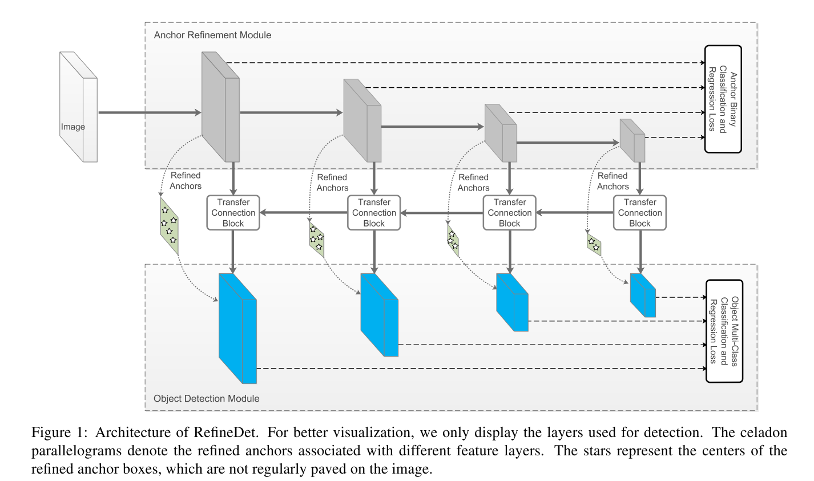
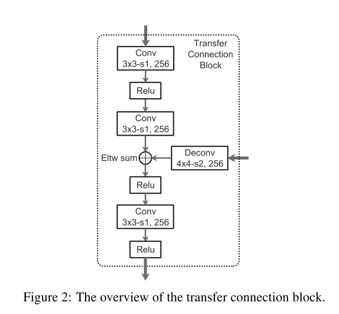

# [Single-Shot Refinement Neural Network for Object Detection](https://arxiv.org/abs/1711.06897)

Date: 11/18/2017  
Tags: task.object_detection

- The authors are motivated to create a single-shot (i.e. one-stage, e.g. SDD) object detector whose performance is on par with that of two-stage detectors (e.g. Faster R-CNN)
    - Two-stage detectors have a number of advantages over one-stage methods, namely (1) using two-stage structure with sampling heuristics to handle class imbalance, (2) using two-step cascade to regress the object box parameters, and (3) using two-stage features to describe the object
    - The authors are motivated to develop a single-shot method that also realizes these benefits
- The authors propose a one-stage approach with two inter-connected modules:
    - The anchor refinement module (ARM)
        - This is designed to identify and remove anchors to reduce the search space for the classifier, and to coarsely adjust the locations and sizes of anchors to provide better initialization for the subsequent regression
        - For each anchor (where there are `n` anchors for each regularly spaced grid cell), the anchor refinement module predicts four offsets, as well two confidence scores indicating the presence of foreground objects in the box
        - During training, they discard any refined anchor boxes whose negative confidence is larger than a preset threshold (i.e. hard negative mining), before passing the refined anchor boxes to the object detection model (during inference they let the ODM handle all of the detection, though)
        - The loss function for the ARM consists of a binary loss for whether there is an object present as well as a smooth L1 applied to the regression offsets
    - The object detection module (ODM):
        - This is designed to take the refined anchors as input from the anchor refinement module to further improve the regression and predict multi-class labels on the refined anchors
        - The features from the anchor refinment module are transfered to the object detection module via a transfer connection block (TCB)
            - Only the features from feature maps associated with anchors are passed through the transfer connection block
            - Since the transfer connection block passes on features from feature maps at different levels (e.g. like a feature pyramid network), it integrates large-scale context by adding high level features
        - The loss function for the ODM consists of a softmax loss for whether there is an object present as well as a smooth L1 applied to the regression offsets
- They test the proposed method on PASCAL VOC 2007 and 2012, and MS COCO
    - They use VGG-16 and ResNet-101 as backbones, and build the anchors at different scales for different levels of the feature pyramid
    - They match anchor boxes by assigning all boxes with an overlap higher than 0.5
    - They use hard negative mining, selecting some negative anchor boxes with top loss values to make the ratio between negatives and positives below 3:1
    - They achieve SOTA on PASCAL VOC 2007, and are the first real-time method to achieve detection accuracy above 80% (to the best of their knowledge) on PASCAL VOC 2007
    - They achieve SOTA on PASCAL VOC 2012
    - They achieve SOTA on MS COCO as well
- Through training / experimentation, they note: 
    - Removing the negative anchor filtering in the anchor refinement module and passing all anchors through to the ODM drops mAP by 0.5%
    - Removing the anchor regression from the anchor refinement module reduces mAP by 2.2%
    - The addition of the transfer connection blocks improves the mAP by 1.1%

## Single-Shot Refinement Network

## Transfer Connection Block

